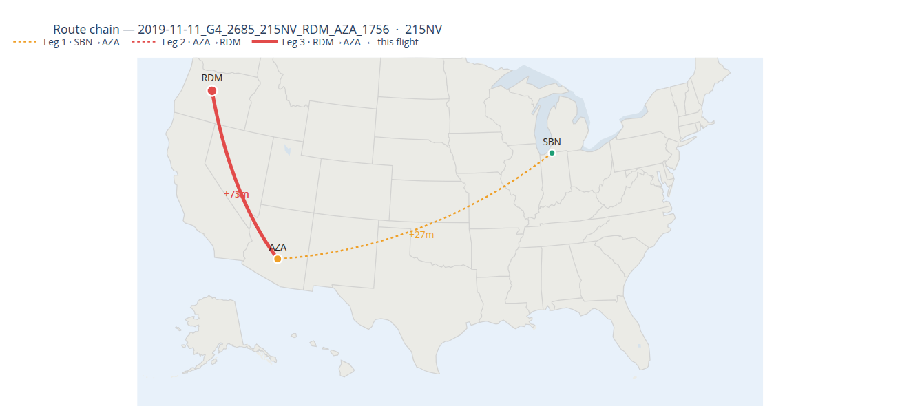

# Flight Delay Prediction

```{r}
#| echo: false
#| out-width: "100%"


```

## A Propagation-Aware Machine Learning Framework

This site presents our team's work on modeling and predicting flight delays in the United States using large-scale data and machine learning. The project focuses on understanding how delays emerge from the interaction of operational constraints, weather, and network effects — particularly how disruptions propagate through aircraft rotations and airport systems.

Using tens of millions of flight records enriched with weather and temporal data, we develop a structured feature engineering and modeling pipeline that reflects real-world conditions. Our approach emphasizes pre-departure prediction, time-aware evaluation, and scalable system design, ensuring that results are both analytically meaningful and operationally relevant.

While this work is primarily focused on prediction and analysis, it also lays the groundwork for more advanced system-level capabilities — including real-time monitoring, network-level reasoning, and simulation-based decision support.

---

## What You'll Find Here
 
- **About** — Team background, motivation, and project context  
- **Paper** — Full research write-up, methodology, and results  
- **ML Workflow** — Step-by-step modeling and experimentation process (excluding full pipeline execution)  
- **AeroFlux** — Conceptual extension toward real-time, network-aware prediction and simulation  

