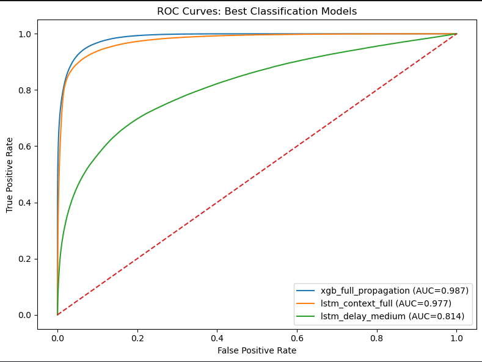
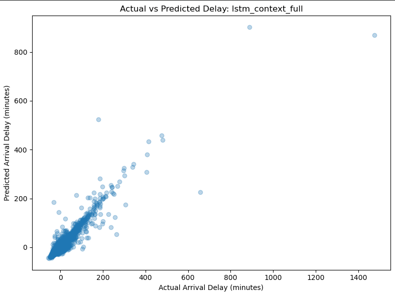

::: {.callout-note appearance="minimal"}
Abstract 

Flight delays remain one of the most persistent operational challenges in modern aviation, affecting airline efficiency, passenger satisfaction, and the broader transportation network. In this study, we examine flight delays within the United States using machine learning, exploratory data analysis, and engineered operational features.

Using Bureau of Transportation Statistics (BTS) flight records enriched with weather and temporal features, we construct predictors related to schedule timing, prior aircraft movement, weather conditions, and airport-level activity. We evaluate multiple supervised and unsupervised learning approaches and even some neural networks using LSTMs.

Our findings suggest that delay behavior is shaped by a combination of operational and environmental effects, especially upstream aircraft delay propagation, airport congestion patterns, and weather-related variables. Tree-based (with extreme gradient boosting) approaches and penalized regression provide the most stable predictive performance, while simpler baseline models remain valuable for interpretation.
:::

---

# Introduction & Background

## Motivation

Flight delays represent one of the most visible operational challenges in modern aviation. A single disruption can ripple across aircraft rotations, crews, passengers, and airports, creating cascading effects throughout the network.

Understanding the causes of delay propagation is critical for improving airline efficiency and passenger reliability.

## Related Works 

- Add at least 3 

## Research Questions

This study seeks to answer the following questions:

1. Which operational and weather variables most strongly predict flight delays?
2. How strongly do delays propagate from prior flights?
3. Which machine learning models best classify delayed flights?

## What This Research Contributes

This study contributes a route-focused machine learning framework for airline delay analysis. By combining exploratory analysis, feature engineering, classification modeling, and model comparison, we provide a systematic approach for identifying the drivers of flight delays.

# Data 

## Data Sources & Pipeline 

### Data Pipeline

The pipeline integrates three independent data streams — Bureau of Transportation Statistics (BTS) on-time performance records, NOAA Global Surface Hourly weather observations, and airport reference dimensions — into a single analytical dataset suitable for delay prediction modelling. @fig-pipeline provides a schematic overview of each stage. The sections below describe each stage in turn.

```{r}
#| label: fig-pipeline
#| fig-cap: "Overview of the flight delay data pipeline, from raw data sources through ingestion, cleaning, temporal alignment, feature engineering, and final output."
#| fig-alt: "A flowchart showing seven stages of the flight delay pipeline: data sources, ingestion, cleaning and normalisation, timestamp alignment and join, feature engineering, postprocessing, and output."
#| echo: false
#| out-width: "100%"
knitr::include_graphics("images/common_site/data-pipeline.png")
```

### Data Sources & Methods 

Flight performance data are sourced from the BTS Transtats PREZIP endpoint, which publishes monthly on-time reporting files for all US carriers. Weather observations are obtained from the NOAA National Centers for Environmental Information (NCEI) global-hourly dataset via a REST API, providing sub-hourly surface measurements at reporting stations worldwide. Airport and station reference data are drawn from the OurAirports CSV registry and the NOAA Integrated Surface Database (ISD) station history file, which together supply the geographic coordinates and ICAO codes required to link flight records to their corresponding weather stations.

The primary data sources for this project were:

- The Bureau of Transportation Statistics (BTS) Airline On-Time Performance dataset and the National Oceanic and Atmospheric Administration (NOAA) National Centers for Environmental Information (NCEI) global hourly weather dataset [@bts_ontime; @noaa_ncei]. 

- To support geospatial alignment between flights and environmental conditions, additional metadata sources were incorporated, including the NOAA Integrated Surface Database (ISD) station history dataset for weather station metadata and the OurAirports global airport dataset for airport identifiers and geographic coordinates [@noaa_isd_history; @ourairports]. 

The data pipeline also relied on auxiliary airport and station reference data to connect flights to airport metadata, time zones, and weather stations. The overall pipeline included BTS ingestion, airport and station reference construction, weather ingestion, temporal and spatial joins, and downstream feature engineering. These stages were implemented as a modular, cached pipeline to support reproducibility and scalable re-runs.

The BTS data provided detailed flight-level operational records for 2019, including scheduled and actual departure and arrival times, origin and destination airports, carrier information, delay durations, cancellation indicators, diversion indicators, taxi times, and delay-cause variables. The NOAA weather data provided airport-associated weather observations such as temperature, wind speed, wind direction, and ceiling height, which were joined to flights using a backward-looking as-of temporal join.

Aircraft registry variables from the FAA were initially considered. However, because only a 2025 registry snapshot was available while the operational flight data represented 2019 activity, these variables were excluded from the final predictive analysis to avoid temporal inconsistency and possible bias.

#### Data Source Resource Links

The pipeline draws on four publicly available data sources, summarised in @tbl-sources. All sources are freely accessible and updated on a regular basis.

```{r}
#| label: tbl-sources
#| tbl-cap: "Primary data sources used in the flight delay pipeline."
#| echo: false

library(knitr)

sources <- data.frame(
  Source = c(
    "BTS Transtats — On-Time Performance",
    "BTS Transtats — On-Time Overview",
    "NOAA NCEI — Integrated Surface Database (ISD)",
    "NOAA NCEI — Global Hourly data search",
    "OurAirports — Open data downloads",
    "OurAirports — GitHub repository"
  ),
  Description = c(
    "Monthly carrier on-time performance records; the primary source of flight departure, arrival, and delay data.",
    "Landing page for the BTS on-time reporting programme, including data documentation and field descriptions.",
    "Global hourly surface weather observations compiled from over 100 sources, spanning 1901 to present across more than 14,000 active stations.",
    "Interactive and programmatic access to the NCEI global-hourly subset, supporting station search and date-range subsetting.",
    "Open-data download page for airport reference files, including airports.csv with IATA/ICAO codes, coordinates, and metadata.",
    "GitHub-hosted daily data dumps for all OurAirports CSV files; the canonical source since November 2021."
  ),
  URL = c(
    "[transtats.bts.gov](https://www.transtats.bts.gov/DL_SelectFields.aspx?gnoyr_VQ=FGJ&QO_fu146_anzr=b0-gvzr)",
    "[transtats.bts.gov/ontime](https://www.transtats.bts.gov/ontime/)",
    "[ncei.noaa.gov/products/land-based-station/integrated-surface-database](https://www.ncei.noaa.gov/products/land-based-station/integrated-surface-database)",
    "[ncei.noaa.gov/access/search/data-search/global-hourly](https://www.ncei.noaa.gov/access/search/data-search/global-hourly)",
    "[ourairports.com/data](https://ourairports.com/data/)",
    "[github.com/davidmegginson/ourairports-data](https://github.com/davidmegginson/ourairports-data)"
  )
)

kable(sources, col.names = c("Source", "Description", "URL"), align = c("l", "l", "l"))
```

### Ingestion

Each data stream is ingested independently. BTS monthly ZIP archives are downloaded with exponential backoff, extracted, and parsed into Polars DataFrames with explicit schema inference and null handling before being serialised to Parquet. Weather records are retrieved in station-month chunks of 25 stations per request, returned as JSON, and similarly persisted to monthly Parquet cache files. Airport and station reference data are loaded from CSV and held in memory as dimension tables. Caching intermediate outputs at this stage is deliberate: it decouples the computationally expensive download and format-conversion steps from all downstream transformations, allowing the pipeline to be re-run from clean intermediates without re-fetching raw data.

### Cleaning and normalization 

Flight records are filtered to a defined route universe — a set of core airport pairs plus permissible two-hop connections — and deduplicated. Weather records undergo field-level parsing to extract temperature (`TMP`), wind speed and direction (`WND`), and ceiling height (`CIG`) from their packed NOAA format representations; observations with missing values across all primary meteorological fields are dropped. On the reference side, each airport in the BTS route universe is matched to its best-candidate ISD weather station using a nearest-neighbour procedure over geodetic distance, with timezone resolution falling back to a longitude-based estimate where the `timezonefinder` library cannot resolve a canonical IANA zone.

### Timestamp alignment and temporal join

Correct temporal alignment between flight records and weather observations is the most consequential step in the pipeline, and the one most susceptible to subtle error. Flight departure and arrival times in BTS data are recorded in **local airport time** as four-digit integers (HHMM), with no timezone annotation and a known edge case at midnight where the integer representation rolls over incorrectly. These are first converted to timezone-aware datetimes using the IANA timezone resolved for each airport, then projected to **UTC** by applying `ZoneInfo`-based offsets. Weather observations from NOAA are similarly recorded in station-local time; these are converted to UTC using station-level timezone mappings derived from the reference dimension stage.

Once both datasets share a common UTC timeline, flight records are joined to weather observations using an **as-of join**: for each departure or arrival event, the most recent weather observation at the corresponding station that precedes the event time is selected. This approach correctly handles the irregular and variable cadence of surface weather reporting — stations do not report on a fixed schedule, and naive equi-joins on rounded timestamps would systematically introduce look-ahead bias or large temporal gaps. Separate as-of joins are performed for the origin station at departure time and the destination station at arrival time, yielding paired meteorological conditions for both endpoints of every flight.

Failure to handle timezones rigorously at this stage would propagate systematic errors through all downstream features. A one-hour offset error at a UTC−5 airport, for example, would cause the as-of join to select weather observations from the wrong side of a frontal passage, corrupting both the meteorological predictors and any propagation-chain features that depend on accurate sequencing of events.

### Feature engineering

Three families of derived features are constructed from the aligned dataset. **Flight-level features** include a unique flight identifier constructed from carrier, tail number, origin, destination, and scheduled departure time; aircraft rotation sequences linking successive legs flown by the same tail number; and the standard BTS delay component breakdown (carrier, weather, NAS, security, late aircraft). **Airport-level features** aggregate traffic volume and delay rates within configurable time windows around each departure, capturing congestion dynamics at both origin and destination. **Route-level features** encode delay propagation along rotation chains: a late-aircraft delay on an inbound leg is explicitly linked to the downstream departure it constrains, allowing the model to condition on upstream disruption state.

A **two-hop flight** represents a single aircraft operating two consecutive legs on the same day, connected by a turnaround at an intermediate airport. When the first leg arrives late, the delayed aircraft becomes the inbound for the second leg, compressing or eliminating the scheduled ground time and propagating the delay forward. @fig-two-hop illustrates this for tail N471AA operating BOS → ATL → MIA: a 52-minute departure delay on Leg 1 carries through the ATL turnaround and manifests as a 49-minute departure delay on Leg 2, despite no adverse weather at ATL. This propagation mechanism is captured in the dataset through the `prev_arr_late_15` and `rotation_continuity_flag` columns, which allow the model to condition on upstream disruption state when predicting downstream delays.

```{r}
#| label: fig-two-hop
#| fig-cap: "Two-hop delay propagation for tail N471AA (BOS → ATL → MIA, 2024-03-15). A 52-minute departure delay on Leg 1 propagates to a 49-minute delay on Leg 2 via the tail rotation, independent of weather conditions at the intermediate airport."
#| fig-alt: "Diagram showing two flight legs sharing a tail number, with delay columns, weather as-of joins, and a propagation arrow connecting the delay on the first leg to the second."
#| echo: false
#| out-width: "100%"
knitr::include_graphics("images/paper/2hop-clean.png")
```

Turnaround time captures the buffer between flights:

$$
Turnaround_i = DepartureTime_i - PreviousArrivalTime_i
$$

See @tbl-predictors for more information on engineered features. 

### Postprocessing and output

A `PostProcessConfig` object specifies the column subset retained for modelling, allowing the full engineered dataset to be filtered to task-specific representations without rerunning upstream stages. Final outputs are written as monthly and annual Parquet files containing the joined flight-weather records, alongside separate Parquet tables for the canonical flight records, airport-time aggregates, route-time aggregates, aircraft rotation sequences, and delay propagation chains.

## Prediction Targets

We considered flight delay prediction as both a regression and classification problem. Let

$$
Y_i^{(reg)} = \text{ArrDelay}_i
$$

denote the arrival delay in minutes for flight $i$, and let

$$
Y_i^{(cls)} =
\begin{cases}
1 & \text{if } \text{ArrDel15}_i = 1 \\
0 & \text{otherwise}
\end{cases}
$$

denote whether the flight arrived at least 15 minutes late.

Thus, our predictive tasks were:

1. **Regression:** predict continuous arrival delay in minutes.
2. **Classification:** predict whether a flight experiences a material arrival delay.

### Raw Predictors and Important Data Elements

Table @tbl-predictors summarizes the major predictors and supporting data elements used in the pipeline.

| Category | Variables / Data Items | Description and Role in Modeling |
|:---|:---|:---|
| Flight identifiers and route | `FlightDate`, `Reporting_Airline`, `Tail_Number`, `Origin`, `Dest`, `route_key`, `flight_id` | Core identifiers used to define each flight, link feature tables, and represent route-level context. |
| Schedule and realized timing | `CRSDepTime`, `DepTime`, `CRSArrTime`, `ArrTime`, `dep_ts_sched`, `dep_ts_actual`, `arr_ts_sched`, `arr_ts_actual`, UTC timestamp variants | Used to represent schedule adherence, construct valid temporal ordering, and support weather joins and aircraft rotation logic. |
| Delay targets and related operational outcomes | `ArrDelay`, `ArrDel15`, `DepDelay`, `DepDel15`, `Cancelled`, `Diverted` | Primary response variables and closely related operational outputs used in modeling and filtering. |
| Surface movement and flight characteristics | `TaxiOut`, `TaxiIn`, `Distance`, `ActualElapsedTime` | Capture operational complexity, congestion effects, and route structure. |
| Delay cause information | `CarrierDelay`, `WeatherDelay`, `NASDelay`, `LateAircraftDelay` | Useful for descriptive analysis, route aggregation, and interpretation of operational drivers of delay. |
| Temporal features | Departure hour, weekday, month, local date, UTC date, seasonal indicators, holiday indicators | Capture cyclic demand, seasonal traffic patterns, and calendar effects. |
| Airport reference data | Airport name, municipality, country, latitude, longitude, IATA code, ICAO code, airport timezone | Used to map BTS airports to weather stations, assign time zones, and support timestamp normalization. |
| Weather station reference data | NOAA station ID, station timezone, airport-to-station mapping | Used to associate flights with nearby weather observations and enable correct UTC conversion of NOAA timestamps. |
| Weather predictors | `dep_temp_c`, `dep_wind_speed_m_s`, `dep_wind_dir_deg`, `dep_ceiling_height_m`, `arr_temp_c`, `arr_wind_speed_m_s`, `arr_wind_dir_deg`, `arr_ceiling_height_m` | Represent meteorological conditions associated with the departure and arrival environments. These are joined temporally using the most recent prior observation within a two-hour window. |
| Aircraft rotation / propagation features | Previous flight ID, previous origin and destination, previous arrival delay, previous departure delay, turnaround time, continuity flag, aircraft leg number, cumulative delay by aircraft-day | Capture propagation effects caused by late inbound aircraft and tight turnarounds. These were among the most meaningful operational predictors. |
| Chain and cascade indicators | `has_prev_leg`, `has_next_leg`, `is_middle_leg`, tight turnaround flags | Represent whether a flight is embedded within a larger aircraft sequence and whether it is vulnerable to upstream or downstream delay propagation. |
| Airport-time aggregate context | Hourly airport flight counts, average delay, median delay, delay rate, cancellation rate, diversion rate, taxi metrics, rolling means over 1h/3h/6h | Capture airport congestion and short-horizon system state. |
| Route-time aggregate context | Hourly route counts, mean route delay, route delay rate, average weather, rolling means over 1h/3h/6h | Capture recent route-specific operating conditions and network-level delay tendencies. |

: Major predictors and important data items used in the flight delay pipeline. {#tbl-predictors}

## Limitations in Data

Several limitations should be noted:

- BTS delay categories are aggregated and sometimes coarse
- weather observations may not perfectly represent local flight conditions
- route-level analysis cannot capture all national network effects
- airline operational decisions such as crew scheduling are not directly observed

Despite these limitations, the dataset provides a strong foundation for studying delay patterns.

- Add catalog as appendix item 


**Note: create a section of the site that represents reproducable instructions of our project and data processing steps, including code snippets and explanations.**

## Initially started with a BWI–EWR Market Pair 

The BWI–EWR corridor sits within one of the most operationally complex airspaces in the United States. Newark Liberty International Airport operates within the highly congested New York airspace, while BWI serves as a key mid-Atlantic hub.

Flights between these airports are vulnerable to multiple sources of disruption:

- upstream aircraft delays
- weather disruptions
- airspace congestion
- operational scheduling constraints


# EDA  

## Distribution of Delays

## Delays by Time of Day

## Weather vs Delay

## Delay Propagation 

## Centrality Metrics 
```{r}
#| label: fig-centrality-metrics-airport-bubble
#| fig-cap: "Centrality Metrics - Airport Bubble"
#| fig-alt: "Centrality Metrics - Airport Bubble"
#| echo: false
#| out-width: "100%"
knitr::include_graphics("images/paper/airport-centrality-bubble.png")
```


....Otehrs....

---

# Models 

We are interested in building an multi-output model that both classifies an arrival delay and determins how long that arrival delay will be using 
features that are available during the present time. 

## Phase 1: 2019 Baseline

### Logistic Regression

We begin with a baseline logistic regression model.

$$
P(Y_i = 1|X_i) =
\frac{1}{1 + e^{-\eta_i}}
$$

$$
\eta_i = \beta_0 + \beta_1 X_1 + \beta_2 X_2 + ... + \beta_p X_p
$$

### Ridge Logistic Regression

To address multicollinearity and improve stability we apply ridge regularization.

### Basic Decision Trees

Decision trees provide interpretable classification rules.

### Random Forest

Random forests improve predictive accuracy through ensemble learning.

### K-Nearest Neighbors

KNN classifies flights based on nearby observations in feature space.

### Unsupervised Analysis: Principal Component Analysis

PCA identifies dominant dimensions in the feature space.

### Unsupervised Analysis: K-Means Clustering

## Phase 2: Multi Year 

In the final modeling training phase we used all our data. The 10 year run used over 61 million final training records, tuned it with rolling time-aware 5 fold cross-validation across historical years, then evaluated it on a fully unseen 2025 holdout test year containing 6.86 million flights. In total we are working with around 70 million flight records! The following sections will cover the details and how well the models performed. 

### Hardware 

When working with larger data sets models were trained on a local workstation running Ubuntu 22.04.5 LTS (64-bit) with kernel version 6.8. The system is equipped with an AMD Ryzen 9 7900X processor featuring 24 logical cores and boost speeds up to 5.65 GHz, along with approximately 96 GB of system memory. The machine also includes both integrated AMD graphics and a discrete NVIDIA GPU, although model training was mostly conducted using CPU resources and GPU usage on 4 GB of VRAM didn't yield improved performance. The ML-Pipeline is still configured to run on GPU if desired. This hardware configuration provides substantial parallel processing capability and memory bandwidth, enabling efficient handling of large-scale data processing, feature engineering, and machine learning model training workflows. 

### LSTM Spatio-Temporal Flight Delay Model

#### Overview

A Long Short-Term Memory (LSTM) neural network was developed to model flight delay 
propagation using sequential aircraft rotation history. Unlike tree-based models that 
treat each flight independently, the LSTM learns temporal dependencies across prior legs 
operated by the same tail number — naturally representing how delays cascade through a 
rotation chain.

For a **2-hop propagation network**, the current flight is conditioned on the two most 
recent upstream legs:

$$
JFK \rightarrow BOS \rightarrow ATL \rightarrow MIA
$$

If the current flight is $ATL \rightarrow MIA$, then $JFK \rightarrow BOS$ and 
$BOS \rightarrow ATL$ form its sequential context.

---

#### Model Architecture

```{r}
#| label: fig-lstm
#| fig-cap: "LSTM architecture for flight delay prediction. The network encodes a 3-timestep aircraft rotation sequence and produces two output heads: a binary delay classifier and a continuous delay regressor."
#| fig-alt: "A diagram of the LSTM model architecture showing a sequential encoder feeding into a classification head and a regression head."
#| echo: false
#| out-width: "100%"
knitr::include_graphics("images/paper/lstm-model.png")
```

#### Input Representation

Each flight $i$ is encoded as a 3D sequence tensor:

$$
\mathbf{X}_i \in \mathbb{R}^{T \times F}
$$

where $T = 3$ timesteps represent the **previous-2 leg**, **previous-1 leg**, and 
**current flight context**, and $F$ is the number of engineered features per timestep. 
Across all training samples the full tensor is:

$$
\mathbf{X} \in \mathbb{R}^{N \times T \times F}
\quad \text{e.g.,} \quad (5{,}000{,}000,\ 3,\ 29)
$$

Features at each timestep include prior arrival and departure delays, turnaround gap, 
distance, time-of-day, weekday, month, weather variables, route frequency, and 
congestion proxies.

#### Preprocessing and Scaling

Neural networks are sensitive to feature scale. The tensor is temporarily reshaped from 
$(N, T, F)$ to $(N \cdot T,\ F)$, standardised via:

$$
z = \frac{x - \mu}{\sigma}
$$

then reshaped back, preserving sequence structure while ensuring stable gradient flow 
during training.

#### Sequence Encoder

The LSTM processes each timestep $t$ and updates a hidden state:

$$
\mathbf{h}_t = \text{LSTM}(\mathbf{x}_t,\ \mathbf{h}_{t-1})
$$

The final hidden state $\mathbf{h}_T$ serves as a compact representation of the full 
rotation history and is passed to both output heads. Each LSTM unit learns a temporal 
pattern from the input sequence; more units increase model capacity at the cost of 
overfitting risk.

Limiting the network to 2 hops ($T = 3$) provides a practical guard against exploding 
gradients, while the LSTM gating mechanism — maintaining separate long-term and 
short-term memory paths — mitigates the vanishing gradient problem inherent in standard 
RNNs.

A **dropout rate of 20%** was applied to LSTM outputs during training, randomly 
deactivating neurons to prevent the model from over-relying on any single feature or 
pattern.

---

#### Multi-Task Output Heads

The shared encoder feeds two independent output heads, enabling simultaneous binary 
classification and continuous regression from a single forward pass.

#### Classification Head

$$
\hat{p}_i = \sigma(W_c\, \mathbf{h}_T + b_c)
$$

Produces the probability that flight $i$ is delayed by 15 minutes or more.

#### Regression Head

$$
\hat{y}_i = W_r\, \mathbf{h}_T + b_r
$$

Produces the predicted delay in minutes as a continuous value.

---

#### Loss Function

Both tasks are trained simultaneously using a single combined loss, so the weight updates from backpropagation account for both the classification and regression errors in every pass.

$$
\mathcal{L} = \mathcal{L}_{cls} + \lambda\, \mathcal{L}_{reg}
$$

where $\lambda$ balances the contribution of each term. $\lambda$ scales the regression loss so that neither task dominates training, 
since BCE and MSE naturally operate on different numerical scales.

**Classification** uses binary cross-entropy (BCE):

$$
\mathcal{L}_{cls} = -\sum_i \left[ y_i \log(\hat{p}_i) + (1 - y_i)\log(1 - \hat{p}_i) \right]
$$

This penalizes confident wrong predictions logarithmically, making it well-suited to 
binary delay outcomes.

**Regression** uses mean squared error (MSE):

$$
\mathcal{L}_{reg} = \sum_i \left( Y_i^{(reg)} - \hat{Y}_i^{(reg)} \right)^2
$$

Squaring the residuals penalizes large errors disproportionately, pushing the model to 
minimize severe mispredictions of delay magnitude.

---

#### Limitations and Model Status

Despite its architectural strengths, the LSTM was **dropped from the 10-year training 
run** due to:

- Higher memory footprint than gradient-boosted alternatives
- Slower training at scale ($N > 5\text{M}$ samples)
- Reduced interpretability compared to tree-based models
- Non-trivial tensor preparation and scaling pipeline

The model is retained in this paper to document its design and to motivate future 
sequence-based extensions, which may include:

- Spatio-Temporal Graph Convolutional Networks
- Transformer sequence models
- Graph Attention Networks
- Hybrid LSTM + airport graph embeddings

### XGBoost 

Using a tree allows tree ensembles to learn subtle operational patterns very effectively.

### XGBoost Classification Model

$$
\hat{p}_i
=
P(Y_i^{(cls)} = 1 \mid \mathbf{x}_i)
=
\sigma\left(
\sum_{m=1}^{M} f_m(\mathbf{x}_i)
\right)
$$

where

$$
\sigma(z)=\frac{1}{1+e^{-z}}
$$

and $M = 300$ boosting trees.

### Classification Decision Rule

$$
\hat{Y}_i^{(cls)} =
\begin{cases}
1 & \text{if } \hat{p}_i \ge 0.5 \\
0 & \text{otherwise}
\end{cases}
$$

### XGBoost Regression Model

$$
\hat{Y}_i^{(reg)}
=
\sum_{m=1}^{M} g_m(\mathbf{x}_i)
$$

### Boosting Objective

$$
\mathcal{L}^{(t)}
=
\sum_{i=1}^{n}
l\left(
y_i,\hat{y}_i^{(t-1)} + f_t(\mathbf{x}_i)
\right)
+
\Omega(f_t)
$$

### Tree Complexity Penalty

$$
\Omega(f)
=
\gamma T
+
\frac{1}{2}\lambda \sum_{j=1}^{T} w_j^2
$$

# Model Evaluation Metrics & Comparitive Perfromance  

## ML Pipeline 

- Add diagram of model training and evaluation process - move to modeling section 
- Explain what the ML Pipeline is 

## Cross Validation and Hyper Parameter Tuning 

Train-Test Splits for CV used expanding window strategy....

## Feature Importances 

```{r}
#| label: tbl-features
#| tbl-cap: "Strong predictive features used in the flight delay model."
#| echo: false
library(knitr)

features <- data.frame(
  Feature = c(
    "Prior Leg Delays",
    "Aircraft Rotation Continuity",
    "Turnaround Minutes",
    "Cumulative Aircraft Delays",
    "Weather at Origin/Destination",
    "Route Congestion",
    "Airport Traffic Volume",
    "Schedule Timing",
    "Aircraft Metadata"
  ),
  Description = c(
    "Whether the incoming flight arrived late, directly propagating delay forward.",
    "Tracks whether the same aircraft flew the previous leg without interruption.",
    "Time between aircraft arrival and scheduled next departure at the gate.",
    "Rolling sum of delays accumulated by the aircraft throughout the day.",
    "Hourly surface conditions — wind, visibility, precipitation — at both airports.",
    "How frequently flights on this route experience delays due to airspace demand.",
    "Total departures and arrivals at the airport within a given time window.",
    "Departure hour and day-of-week capturing peak travel and operational patterns.",
    "Aircraft type and age affecting turnaround speed and mechanical reliability."
  )
)

kable(features, col.names = c("Feature", "Description"), align = c("l", "l"))

```

## Hyperparameter Tuning 

```{r}
#| label: tbl-hyperparameters
#| tbl-cap: "Winning XGBoost hyperparameter configuration selected from four candidate configurations."
#| echo: false
library(knitr)

hyperparams <- data.frame(
  Hyperparameter = c(
    "n_estimators",
    "max_depth",
    "learning_rate",
    "subsample",
    "colsample_bytree",
    "min_child_weight",
    "reg_lambda",
    "tree_method",
    "device"
  ),
  Value = c(
    "300",
    "6",
    "0.05",
    "0.8",
    "0.8",
    "1",
    "1.0",
    "hist",
    "cpu"
  )
)

kable(hyperparams, col.names = c("Hyperparameter", "Value"), align = c("l", "r"))
```

### Selected Hyperparameters

$$
M = 300,\quad
d = 6,\quad
\eta = 0.05,\quad
s = 0.8,\quad
c = 0.8
$$

where:

- $M$ = number of trees  
- $d$ = maximum tree depth  
- $\eta$ = learning rate  
- $s$ = row subsample ratio  
- $c$ = feature subsample ratio  


where $\mathcal{L}_i$ represents all previous same-day legs for aircraft $i$.


### Temporal Cross Validation

$$
\mathcal{D}_{train}^{(k)} = \{2015,\dots,t_k\},
\qquad
\mathcal{D}_{val}^{(k)} = \{t_k+1\}
$$
Example:

### Final Holdout Evaluation Design

$$
\mathcal{D}_{final\ train} = \{2015,\dots,2024\}
\qquad
\mathcal{D}_{test} = \{2025\}
$$

### Model Comparison 

```{r}
#| label: fig-auc-lstm-xgboost
#| fig-cap: "AUC for LSTM and XGBoost Models"
#| fig-alt: "AUC for LSTM and XGBoost Models"
#| echo: false
#| out-width: "100%"

```


```{r}
#| label: fig-actual-v-pred-lstm-xgboost
#| fig-cap: "Actual vs Predicted for LSTM and XGBoost"
#| fig-alt: "Actual vs Predicted for LSTM and XGBoost"
#| echo: false
#| out-width: "100%"

```

## Results 

$$
AUC = 0.9903,\quad
F_1 = 0.9018,\quad
MAE = 6.55,\quad
RMSE = 20.36
$$

### Limitations 

The 2-hop propagation framework was designed to capture delay carryover from the two most recent upstream aircraft legs. This was a practical and computationally efficient approximation of delay dynamics:
While highly useful, this design imposes important structural limitations for both the :contentReference[oaicite:0]{index=0} and :contentReference[oaicite:1]{index=1} LSTM approaches.


 - Core Limitation: Finite Memory Window. The 2-hop model only observes two upstream legs.
 - Hidden Accumulated Operational Stress. Aircraft systems often degrade gradually throughout the day.
 - Same-Aircraft Only Perspective.
 - The propagation design centered on aircraft tail-number continuity:
 - No Explicit Airport Network Topology. The 2-hop model does not explicitly represent the airport graph:
 - XGBoost can model nonlinear interactions, but it does not maintain hidden recurrent state.
 - Feature Explosion Risk. As hops increase the feature space grows rapidly.
 - Temporal Leakage Risk. Both approaches must ensure upstream features are truly available before prediction time.

---

# Results

## Key Findings

The analysis suggests that delay outcomes are influenced by several interacting factors:

- upstream aircraft delays
- airport congestion patterns
- weather conditions
- temporal scheduling effects

## Operational Interpretation

Predictive models can help identify flights at elevated risk of delay before departure, enabling airlines and planners to anticipate disruptions.

---

# Discussion & Limitations

Several limitations should be considered:

- missing operational factors such as crew and maintenance constraints
- passenger delays 
- imperfect weather measurements
- route-specific findings that may not generalize
- Etc...

Despite these challenges, the framework provides a replicable approach for studying delay behavior.

---

# Conclusion

This study demonstrates how machine learning methods can be applied to understand delay dynamics...

Future work could extend this framework to larger airline networks and incorporate time-series modeling approaches.....etc.

---

# Appendex 

## Introduction To Areo Flux and Future Works

AeroFlux is a predictive intelligence system for U.S. domestic flight delays. Given a specific flight — identified by tail number, date, origin, and destination — it predicts whether that flight will arrive delayed by 15 minutes or more, and estimates the delay in minutes. It does this by modeling the full operational context of the aircraft: where it came from, how the previous two legs performed, the turnaround time, cumulative delays accumulated during the day, and weather conditions at departure.

The output is a full prediction report: a probability score, a delay estimate, a comparison against the actual recorded outcome, a geographic map of the aircraft's rotation chain, and a breakdown of the key features that drove the prediction.

```{r}
#| label: fig-aeroflux1
#| fig-cap: "AeroFlux predictive intelligence system user interface"
#| fig-alt: "AeroFlux predictive intelligence system user interface"
#| echo: false
#| out-width: "100%"
knitr::include_graphics("images/aero-flux/app_v2.png")
```

```{r}
#| label: fig-aeroflux2
#| fig-cap: "AeroFlux Flight Map"
#| fig-alt: "AeroFlux Flight Map"
#| echo: false
#| out-width: "100%"
knitr::include_graphics("images/aero-flux/flight-map-app_v2.png")
```

### A precursor to a digital twin

AeroFlux is not yet a digital twin. A true digital twin would ingest live operational data in real time, continuously update its state, and support simulation — answering questions like *what happens to the next four flights on this tail if this departure slips 45 minutes?*

AeroFlux is the immediate precursor. The machine learning pipeline, feature engineering, model inference layer, and interactive interface are all in place. What it currently lacks is the live data feed connecting it to real-time flight state. That connection is the primary objective for the next phase of development. The progression looks like this:

- **Phase 1 (complete)** — Historical proof of concept: models trained, pipeline built, interactive app deployed
- **Phase 2 (next)** — Live data integration: connect to FAA or a commercial flight data API, replace historical lookups with real-time inference, add live weather
- **Phase 3** — Network simulation: propagate predicted delays forward through the rotation chain, model downstream passenger connections
- **Phase 4** — Digital twin: a continuously updated bidirectional model of the domestic flight network with full scenario simulation

[See AeroFlux here](aero-flux.qmd)