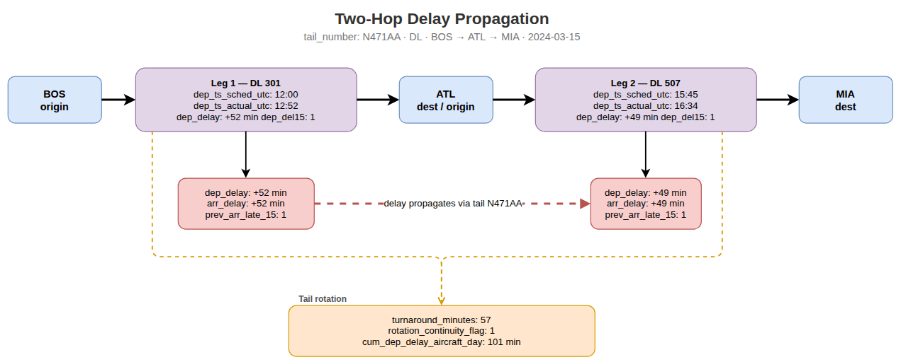

## Abstract

Flight delays remain one of the most persistent operational challenges in modern aviation, affecting airline efficiency, passenger satisfaction, and the broader transportation network. In this study, we examine flight delays within the United States using machine learning, exploratory data analysis, and engineered operational features.

Using Bureau of Transportation Statistics (BTS) flight records enriched with weather and temporal features, we construct predictors related to schedule timing, prior aircraft movement, weather conditions, and airport-level activity. We evaluate multiple supervised and unsupervised learning approaches and even some neural networks using LSTMs.

Our findings suggest that delay behavior is shaped by a combination of operational and environmental effects, especially upstream aircraft delay propagation, airport congestion patterns, and weather-related variables. Tree-based (with extreme gradient boosting) approaches and penalized regression provide the most stable predictive performance, while simpler baseline models remain valuable for interpretation.

---

## Introduction & Background

### Motivation

Flight delays represent one of the most visible operational challenges in modern aviation. A single disruption can ripple across aircraft rotations, crews, passengers, and airports, creating cascading effects throughout the network.

Understanding the causes of delay propagation is critical for improving airline efficiency and passenger reliability.

### Related Works 

- Add at least 3 

### Research Questions

This study seeks to answer the following questions:

1. Which operational and weather variables most strongly predict flight delays?
2. How strongly do delays propagate from prior flights?
3. Which machine learning models best classify delayed flights?

### What This Research Contributes

This study contributes a route-focused machine learning framework for airline delay analysis. By combining exploratory analysis, feature engineering, classification modeling, and model comparison, we provide a systematic approach for identifying the drivers of flight delays.

## Data and Methods

### Data Sources & Pipeline 

#### Data Pipeline

The pipeline integrates three independent data streams — Bureau of Transportation Statistics (BTS) on-time performance records, NOAA Global Surface Hourly weather observations, and airport reference dimensions — into a single analytical dataset suitable for delay prediction modelling. @fig-pipeline provides a schematic overview of each stage. The sections below describe each stage in turn.

```{r}
#| label: fig-pipeline
#| fig-cap: "Overview of the flight delay data pipeline, from raw data sources through ingestion, cleaning, temporal alignment, feature engineering, and final output."
#| fig-alt: "A flowchart showing seven stages of the flight delay pipeline: data sources, ingestion, cleaning and normalisation, timestamp alignment and join, feature engineering, postprocessing, and output."
#| echo: false
#| out-width: "100%"
knitr::include_graphics("images/common_site/data-pipeline.png")
```

#### Data sources

Flight performance data are sourced from the BTS Transtats PREZIP endpoint, which publishes monthly on-time reporting files for all US carriers. Weather observations are obtained from the NOAA National Centers for Environmental Information (NCEI) global-hourly dataset via a REST API, providing sub-hourly surface measurements at reporting stations worldwide. Airport and station reference data are drawn from the OurAirports CSV registry and the NOAA Integrated Surface Database (ISD) station history file, which together supply the geographic coordinates and ICAO codes required to link flight records to their corresponding weather stations.

The primary data sources for this project were:

- The Bureau of Transportation Statistics (BTS) Airline On-Time Performance dataset and the National Oceanic and Atmospheric Administration (NOAA) National Centers for Environmental Information (NCEI) global hourly weather dataset [@bts_ontime; @noaa_ncei]. 

- To support geospatial alignment between flights and environmental conditions, additional metadata sources were incorporated, including the NOAA Integrated Surface Database (ISD) station history dataset for weather station metadata and the OurAirports global airport dataset for airport identifiers and geographic coordinates [@noaa_isd_history; @ourairports]. 

The data pipeline also relied on auxiliary airport and station reference data to connect flights to airport metadata, time zones, and weather stations. The overall pipeline included BTS ingestion, airport and station reference construction, weather ingestion, temporal and spatial joins, and downstream feature engineering. These stages were implemented as a modular, cached pipeline to support reproducibility and scalable re-runs.

The BTS data provided detailed flight-level operational records for 2019, including scheduled and actual departure and arrival times, origin and destination airports, carrier information, delay durations, cancellation indicators, diversion indicators, taxi times, and delay-cause variables. The NOAA weather data provided airport-associated weather observations such as temperature, wind speed, wind direction, and ceiling height, which were joined to flights using a backward-looking as-of temporal join.

Aircraft registry variables from the FAA were initially considered. However, because only a 2025 registry snapshot was available while the operational flight data represented 2019 activity, these variables were excluded from the final predictive analysis to avoid temporal inconsistency and possible bias.

##### Data Source Resource Links

The pipeline draws on four publicly available data sources, summarised in @tbl-sources. All sources are freely accessible and updated on a regular basis.

```{r}
#| label: tbl-sources
#| tbl-cap: "Primary data sources used in the flight delay pipeline."
#| echo: false

library(knitr)

sources <- data.frame(
  Source = c(
    "BTS Transtats — On-Time Performance",
    "BTS Transtats — On-Time Overview",
    "NOAA NCEI — Integrated Surface Database (ISD)",
    "NOAA NCEI — Global Hourly data search",
    "OurAirports — Open data downloads",
    "OurAirports — GitHub repository"
  ),
  Description = c(
    "Monthly carrier on-time performance records; the primary source of flight departure, arrival, and delay data.",
    "Landing page for the BTS on-time reporting programme, including data documentation and field descriptions.",
    "Global hourly surface weather observations compiled from over 100 sources, spanning 1901 to present across more than 14,000 active stations.",
    "Interactive and programmatic access to the NCEI global-hourly subset, supporting station search and date-range subsetting.",
    "Open-data download page for airport reference files, including airports.csv with IATA/ICAO codes, coordinates, and metadata.",
    "GitHub-hosted daily data dumps for all OurAirports CSV files; the canonical source since November 2021."
  ),
  URL = c(
    "[transtats.bts.gov](https://www.transtats.bts.gov/DL_SelectFields.aspx?gnoyr_VQ=FGJ&QO_fu146_anzr=b0-gvzr)",
    "[transtats.bts.gov/ontime](https://www.transtats.bts.gov/ontime/)",
    "[ncei.noaa.gov/products/land-based-station/integrated-surface-database](https://www.ncei.noaa.gov/products/land-based-station/integrated-surface-database)",
    "[ncei.noaa.gov/access/search/data-search/global-hourly](https://www.ncei.noaa.gov/access/search/data-search/global-hourly)",
    "[ourairports.com/data](https://ourairports.com/data/)",
    "[github.com/davidmegginson/ourairports-data](https://github.com/davidmegginson/ourairports-data)"
  )
)

kable(sources, col.names = c("Source", "Description", "URL"), align = c("l", "l", "l"))
```

#### Ingestion

Each data stream is ingested independently. BTS monthly ZIP archives are downloaded with exponential backoff, extracted, and parsed into Polars DataFrames with explicit schema inference and null handling before being serialised to Parquet. Weather records are retrieved in station-month chunks of 25 stations per request, returned as JSON, and similarly persisted to monthly Parquet cache files. Airport and station reference data are loaded from CSV and held in memory as dimension tables. Caching intermediate outputs at this stage is deliberate: it decouples the computationally expensive download and format-conversion steps from all downstream transformations, allowing the pipeline to be re-run from clean intermediates without re-fetching raw data.

#### Cleaning and normalisation

Flight records are filtered to a defined route universe — a set of core airport pairs plus permissible two-hop connections — and deduplicated. Weather records undergo field-level parsing to extract temperature (`TMP`), wind speed and direction (`WND`), and ceiling height (`CIG`) from their packed NOAA format representations; observations with missing values across all primary meteorological fields are dropped. On the reference side, each airport in the BTS route universe is matched to its best-candidate ISD weather station using a nearest-neighbour procedure over geodetic distance, with timezone resolution falling back to a longitude-based estimate where the `timezonefinder` library cannot resolve a canonical IANA zone.

#### Timestamp alignment and temporal join

Correct temporal alignment between flight records and weather observations is the most consequential step in the pipeline, and the one most susceptible to subtle error. Flight departure and arrival times in BTS data are recorded in **local airport time** as four-digit integers (HHMM), with no timezone annotation and a known edge case at midnight where the integer representation rolls over incorrectly. These are first converted to timezone-aware datetimes using the IANA timezone resolved for each airport, then projected to **UTC** by applying `ZoneInfo`-based offsets. Weather observations from NOAA are similarly recorded in station-local time; these are converted to UTC using station-level timezone mappings derived from the reference dimension stage.

Once both datasets share a common UTC timeline, flight records are joined to weather observations using an **as-of join**: for each departure or arrival event, the most recent weather observation at the corresponding station that precedes the event time is selected. This approach correctly handles the irregular and variable cadence of surface weather reporting — stations do not report on a fixed schedule, and naive equi-joins on rounded timestamps would systematically introduce look-ahead bias or large temporal gaps. Separate as-of joins are performed for the origin station at departure time and the destination station at arrival time, yielding paired meteorological conditions for both endpoints of every flight.

Failure to handle timezones rigorously at this stage would propagate systematic errors through all downstream features. A one-hour offset error at a UTC−5 airport, for example, would cause the as-of join to select weather observations from the wrong side of a frontal passage, corrupting both the meteorological predictors and any propagation-chain features that depend on accurate sequencing of events.

#### Feature engineering

Three families of derived features are constructed from the aligned dataset. **Flight-level features** include a unique flight identifier constructed from carrier, tail number, origin, destination, and scheduled departure time; aircraft rotation sequences linking successive legs flown by the same tail number; and the standard BTS delay component breakdown (carrier, weather, NAS, security, late aircraft). **Airport-level features** aggregate traffic volume and delay rates within configurable time windows around each departure, capturing congestion dynamics at both origin and destination. **Route-level features** encode delay propagation along rotation chains: a late-aircraft delay on an inbound leg is explicitly linked to the downstream departure it constrains, allowing the model to condition on upstream disruption state.

A **two-hop flight** represents a single aircraft operating two consecutive legs on the same day, connected by a turnaround at an intermediate airport. When the first leg arrives late, the delayed aircraft becomes the inbound for the second leg, compressing or eliminating the scheduled ground time and propagating the delay forward. @fig-two-hop illustrates this for tail N471AA operating BOS → ATL → MIA: a 52-minute departure delay on Leg 1 carries through the ATL turnaround and manifests as a 49-minute departure delay on Leg 2, despite no adverse weather at ATL. This propagation mechanism is captured in the dataset through the `prev_arr_late_15` and `rotation_continuity_flag` columns, which allow the model to condition on upstream disruption state when predicting downstream delays.

```{r}
#| label: fig-two-hop
#| fig-cap: "Two-hop delay propagation for tail N471AA (BOS → ATL → MIA, 2024-03-15). A 52-minute departure delay on Leg 1 propagates to a 49-minute delay on Leg 2 via the tail rotation, independent of weather conditions at the intermediate airport."
#| fig-alt: "Diagram showing two flight legs sharing a tail number, with delay columns, weather as-of joins, and a propagation arrow connecting the delay on the first leg to the second."
#| echo: false
#| out-width: "100%"

```

Turnaround time captures the buffer between flights:

$$
Turnaround_i = DepartureTime_i - PreviousArrivalTime_i
$$

See @tbl-predictors for more information on engineered features. 

#### Postprocessing and output

A `PostProcessConfig` object specifies the column subset retained for modelling, allowing the full engineered dataset to be filtered to task-specific representations without rerunning upstream stages. Final outputs are written as monthly and annual Parquet files containing the joined flight-weather records, alongside separate Parquet tables for the canonical flight records, airport-time aggregates, route-time aggregates, aircraft rotation sequences, and delay propagation chains.

## Prediction Targets

We considered flight delay prediction as both a regression and classification problem. Let

$$
Y_i^{(reg)} = \text{ArrDelay}_i
$$

denote the arrival delay in minutes for flight $i$, and let

$$
Y_i^{(cls)} =
\begin{cases}
1 & \text{if } \text{ArrDel15}_i = 1 \\
0 & \text{otherwise}
\end{cases}
$$

denote whether the flight arrived at least 15 minutes late.

Thus, our predictive tasks were:

1. **Regression:** predict continuous arrival delay in minutes.
2. **Classification:** predict whether a flight experiences a material arrival delay.

### Raw Predictors and Important Data Elements

Table @tbl-predictors summarizes the major predictors and supporting data elements used in the pipeline.

| Category | Variables / Data Items | Description and Role in Modeling |
|:---|:---|:---|
| Flight identifiers and route | `FlightDate`, `Reporting_Airline`, `Tail_Number`, `Origin`, `Dest`, `route_key`, `flight_id` | Core identifiers used to define each flight, link feature tables, and represent route-level context. |
| Schedule and realized timing | `CRSDepTime`, `DepTime`, `CRSArrTime`, `ArrTime`, `dep_ts_sched`, `dep_ts_actual`, `arr_ts_sched`, `arr_ts_actual`, UTC timestamp variants | Used to represent schedule adherence, construct valid temporal ordering, and support weather joins and aircraft rotation logic. |
| Delay targets and related operational outcomes | `ArrDelay`, `ArrDel15`, `DepDelay`, `DepDel15`, `Cancelled`, `Diverted` | Primary response variables and closely related operational outputs used in modeling and filtering. |
| Surface movement and flight characteristics | `TaxiOut`, `TaxiIn`, `Distance`, `ActualElapsedTime` | Capture operational complexity, congestion effects, and route structure. |
| Delay cause information | `CarrierDelay`, `WeatherDelay`, `NASDelay`, `LateAircraftDelay` | Useful for descriptive analysis, route aggregation, and interpretation of operational drivers of delay. |
| Temporal features | Departure hour, weekday, month, local date, UTC date, seasonal indicators, holiday indicators | Capture cyclic demand, seasonal traffic patterns, and calendar effects. |
| Airport reference data | Airport name, municipality, country, latitude, longitude, IATA code, ICAO code, airport timezone | Used to map BTS airports to weather stations, assign time zones, and support timestamp normalization. |
| Weather station reference data | NOAA station ID, station timezone, airport-to-station mapping | Used to associate flights with nearby weather observations and enable correct UTC conversion of NOAA timestamps. |
| Weather predictors | `dep_temp_c`, `dep_wind_speed_m_s`, `dep_wind_dir_deg`, `dep_ceiling_height_m`, `arr_temp_c`, `arr_wind_speed_m_s`, `arr_wind_dir_deg`, `arr_ceiling_height_m` | Represent meteorological conditions associated with the departure and arrival environments. These are joined temporally using the most recent prior observation within a two-hour window. |
| Aircraft rotation / propagation features | Previous flight ID, previous origin and destination, previous arrival delay, previous departure delay, turnaround time, continuity flag, aircraft leg number, cumulative delay by aircraft-day | Capture propagation effects caused by late inbound aircraft and tight turnarounds. These were among the most meaningful operational predictors. |
| Chain and cascade indicators | `has_prev_leg`, `has_next_leg`, `is_middle_leg`, tight turnaround flags | Represent whether a flight is embedded within a larger aircraft sequence and whether it is vulnerable to upstream or downstream delay propagation. |
| Airport-time aggregate context | Hourly airport flight counts, average delay, median delay, delay rate, cancellation rate, diversion rate, taxi metrics, rolling means over 1h/3h/6h | Capture airport congestion and short-horizon system state. |
| Route-time aggregate context | Hourly route counts, mean route delay, route delay rate, average weather, rolling means over 1h/3h/6h | Capture recent route-specific operating conditions and network-level delay tendencies. |

: Major predictors and important data items used in the flight delay pipeline. {#tbl-predictors}

### Limitations in Data

Several limitations should be noted:

- BTS delay categories are aggregated and sometimes coarse
- weather observations may not perfectly represent local flight conditions
- route-level analysis cannot capture all national network effects
- airline operational decisions such as crew scheduling are not directly observed

Despite these limitations, the dataset provides a strong foundation for studying delay patterns.

- Add catalog as appendix item 


**Note: create a section of the site that represents reproducable instructions of our project and data processing steps, including code snippets and explanations.**

### Initially started with a BWI–EWR Market Pair 

The BWI–EWR corridor sits within one of the most operationally complex airspaces in the United States. Newark Liberty International Airport operates within the highly congested New York airspace, while BWI serves as a key mid-Atlantic hub.

Flights between these airports are vulnerable to multiple sources of disruption:

- upstream aircraft delays
- weather disruptions
- airspace congestion
- operational scheduling constraints


## EDA  

- Show network map of airports and flight routes - some kind of data visualization that shows the network structure of the flights between BWI and EWR, as well as other connecting routes. This could be a graph or a map visualization that highlights the frequency of flights and the connections between different airports.

## Feature Engineering

### Delay Indicator

### Prior Aircraft Delay


### Temporal Features

Time-based indicators include:

- departure hour
- day of week
- month
- holiday flags

These help capture cyclical delay patterns.

---

## Exploratory Data Analysis

### Distribution of Delays

```{r}
# Histogram of departure delays
# ggplot(df, aes(x = DepDelayMinutes)) +
#   geom_histogram(bins = 50)
```

### Delays by Time of Day

```{r}
# Delay frequency by departure hour
```

### Weather vs Delay

```{r}
# Weather severity vs delay outcome
```

### Delay Propagation

```{r}
# Previous arrival delay vs next departure delay
```

---


---

## Building Classifiers

### Logistic Regression

We begin with a baseline logistic regression model.

$$
P(Y_i = 1|X_i) =
\frac{1}{1 + e^{-\eta_i}}
$$

$$
\eta_i = \beta_0 + \beta_1 X_1 + \beta_2 X_2 + ... + \beta_p X_p
$$

```{r}
# logistic regression model
```

---

### Ridge Logistic Regression

To address multicollinearity and improve stability we apply ridge regularization.

```{r}
# ridge logistic regression
```

---

### Classification Tree

Decision trees provide interpretable classification rules.

```{r}
# classification tree
```

---

### Random Forest

Random forests improve predictive accuracy through ensemble learning.

```{r}
# random forest model
```

---

### K-Nearest Neighbors

KNN classifies flights based on nearby observations in feature space.

```{r}
# knn model
```

---

## Unsupervised Analysis

### Principal Component Analysis

PCA identifies dominant dimensions in the feature space.

```{r}
# PCA analysis
```

### K-Means Clustering

Clustering reveals natural groupings among flight observations.

```{r}
# kmeans clustering
```

---

## Model Comparison

We compare models using metrics such as:

- accuracy
- precision
- recall
- F1 score

```{r}
# model comparison table
```

---

## Results

### Key Findings

The analysis suggests that delay outcomes are influenced by several interacting factors:

- upstream aircraft delays
- airport congestion patterns
- weather conditions
- temporal scheduling effects

### Operational Interpretation

Predictive models can help identify flights at elevated risk of delay before departure, enabling airlines and planners to anticipate disruptions.

---

## Discussion & Limitations

Several limitations should be considered:

- missing operational factors such as crew and maintenance constraints
- imperfect weather measurements
- route-specific findings that may not generalize

Despite these challenges, the framework provides a replicable approach for studying delay behavior.

---

## Conclusion

This study demonstrates how machine learning methods can be applied to understand delay dynamics in the BWI–EWR market pair.

Tree-based methods and penalized regression provide the best balance of predictive performance and interpretability. The analysis highlights the importance of upstream delay propagation and temporal operational patterns.

Future work could extend this framework to larger airline networks and incorporate time-series modeling approaches.

---

## References


## Appendix  

### Data Catalog 


## Hardware 

The models were trained on a high-performance local workstation running Ubuntu 22.04.5 LTS (64-bit) with kernel version 6.8. The system is equipped with an AMD Ryzen 9 7900X processor featuring 24 logical cores and boost speeds up to 5.65 GHz, along with approximately 96 GB of system memory. The machine also includes both integrated AMD graphics and a discrete NVIDIA GPU, although model training was conducted using CPU resources. This hardware configuration provides substantial parallel processing capability and memory bandwidth, enabling efficient handling of large-scale data processing, feature engineering, and machine learning model training workflows.

## Models 

We are interested in building an multi-output model that both classifies an arrival delay and determins how long that arrival delay will be using 
features that are available during the present time. 

Models: 
LSTM -

Model Arch 
units1 is the number of hidden units (neurons) in that LSTM layer
Each unit produces one value in the hidden state vector at each time step. each neuron learns a pattern or signal from your inputs over time.
More units → more capacity → can learn more complex patterns
Fewer units → simpler model → less risk of overfitting

Break data into a step matrix - each example is broken into ordered steps in time or sequence, rather than treated as one flat row. The 
LSTM model needs this 3D matrix to work on. 
We apply some scaling to the data to standardize each feature this allows our neural network to train more effectively thus improving stability 
and convergence. 

Flights contexts in 2 hop would be 3 different time steps. t-2, t-1, t0. One sample would be 3 rows. 

Varients - Use same training function but different inputs and model sizes. 

Making the model bigger adds more context: Answers Does adding richer operational context improve sequence-based delay prediction? 

By keeping the layers to only 2 hops we prevent the exploding gradient problem 
To prevent the vanishing gradient problem we....else we would never reach our optimal value 
LSTMs help us avoid the vanishing and exploding gradient problems by using two seperate paths 
that are for long and short term memories. The gates helps us make relavant predictions 
only remmebering what is needed and forgetting what is not. (explain) 

Regularlization - We applied a dropout regularization to the LSTM outputs, randomly turning off a fraction (dropout, e.g., 20%) of the neurons during training. This helps prevent the model from overfitting by forcing it to not rely too heavily on any single pattern or feature.

Loss Functions 
Binary Cross-Entroy 

$$
\mathcal{L}_{BCE} = -\frac{1}{N} \sum_{i=1}^{N} \left[ y_i \log(p_i) + (1 - y_i) \log(1 - p_i) \right]
$$

MSE 
$$
\mathcal{L}_{MSE} = \frac{1}{N} \sum_{i=1}^{N} (y_i - \hat{y}_i)^2
$$

Evaluation Metrics 

Cross Validation and Hyper Parameter Tuning 

Train-Test Splits for CV. Expanding window folds inside Jan-Oct training period.

    Fold 1: train Jan-Jun, validate Jul
    Fold 2: train Jan-Jul, validate Aug
    Fold 3: train Jan-Aug, validate Sep
    Fold 4: train Jan-Sep, validate Oct
    
FINAL TEST SPLIT
#    Keep Nov-Dec untouched


Tree - 

Metrics:
Classification - AUC, F1, precision, recall, accuracy  
Regression - MAE, RMSE 

- Explain why used and are there better ones to use 

Rows in final modeling table: 6594553
Train rows: 5490189 (Jan 1-Oct 31)
Test rows : 1104364 (Nov 1-Dec 31)

The code performs a time-based train/test split on the flights dataset using November 1, 2019 as the cutoff. A temporal split like this is the correct approach for LSTM modeling on time-series data, as it mirrors real-world prediction conditions and prevents data leakage from future records into training.it is important to split your training and test sets by a fixed date rather than randomly. Random splitting allows future data to leak into the training set, meaning the model inadvertently learns from information it would not have had access to in a real-world scenario. By splitting on a specific date like November 1, 2019, we ensure the model is only trained on the past and evaluated on truly unseen future data, which gives a more honest and reliable measure of model performance.

- Add diagram of model training and evaluation process - move to modeling section 


