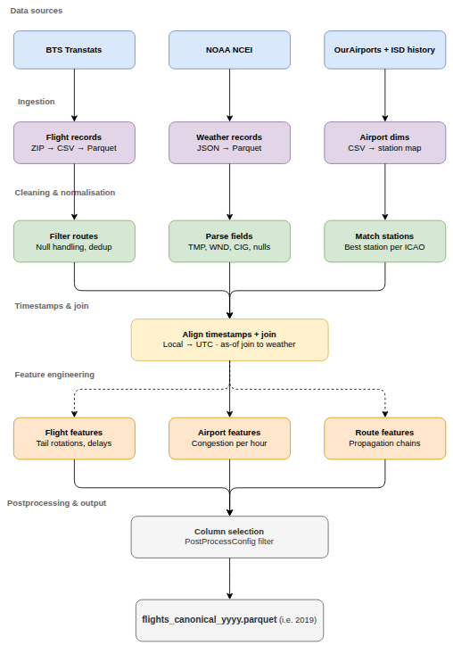
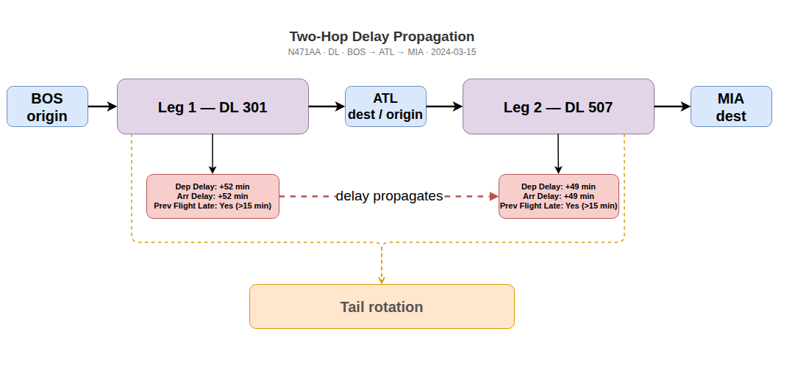
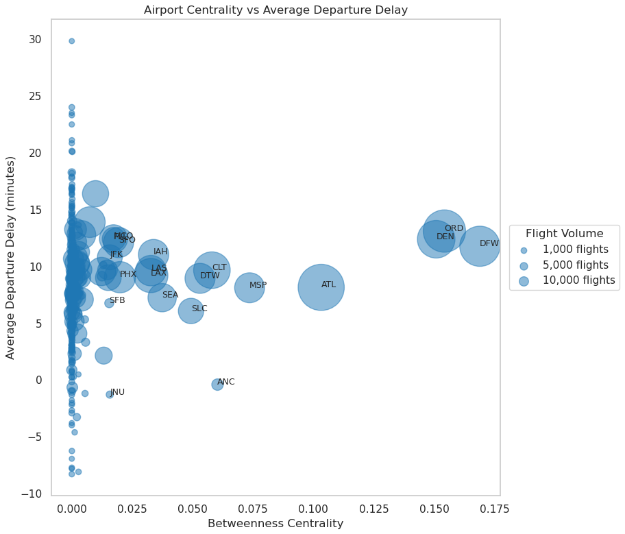
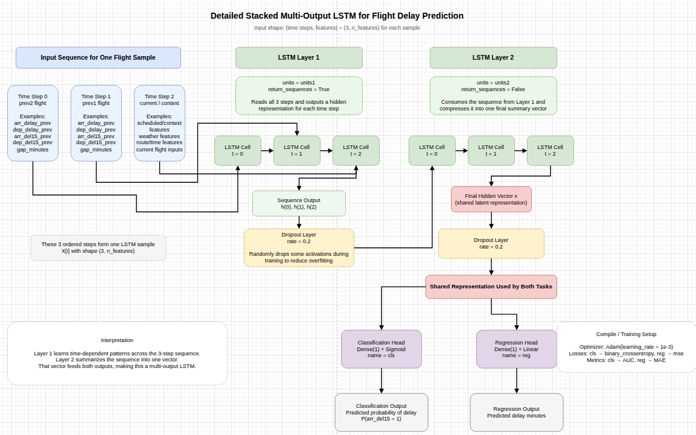
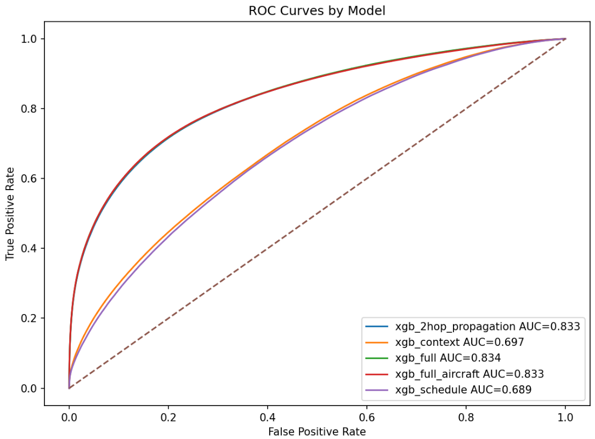
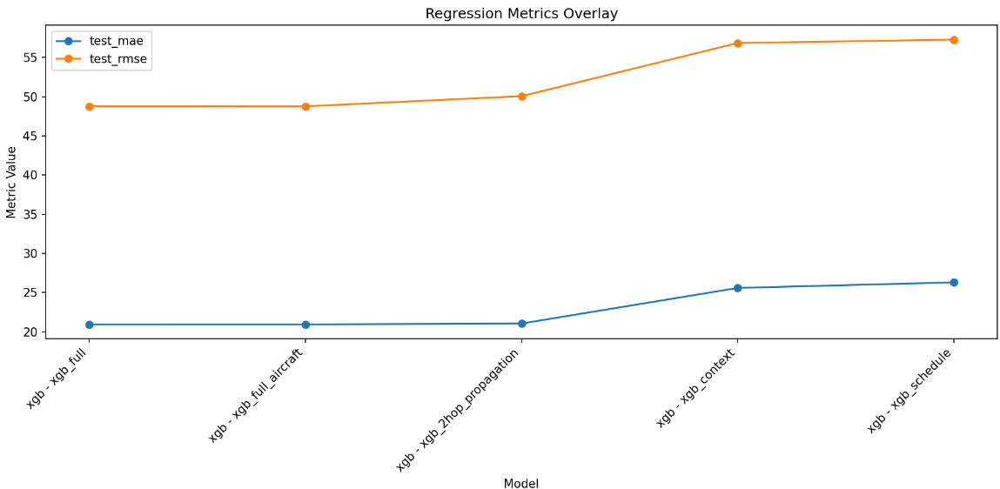
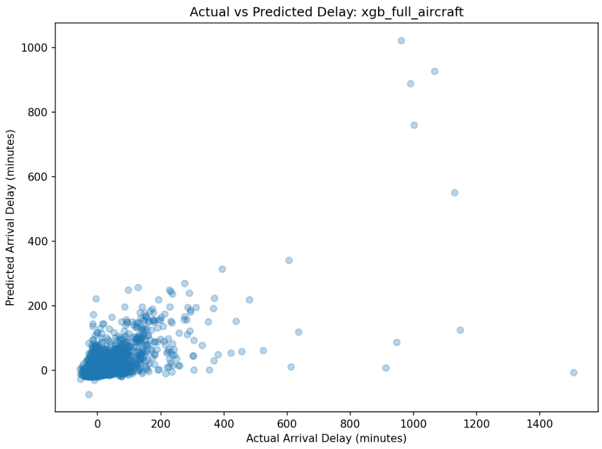
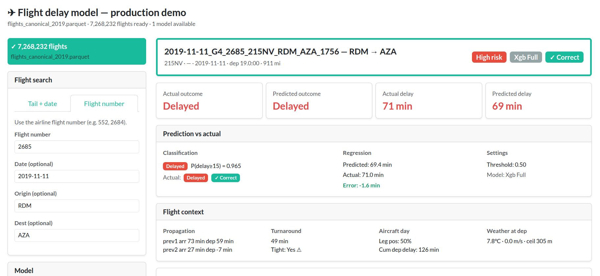

::: {.callout-note appearance="minimal"}
Abstract 

Flight delays remain one of the most persistent operational challenges in modern aviation, affecting airline efficiency, passenger satisfaction, and the broader transportation network. In this study, we examine flight delays within the United States using machine learning, exploratory data analysis, and engineered operational features.

Using Bureau of Transportation Statistics (BTS) flight records enriched with weather and temporal features, we construct predictors related to schedule timing, prior aircraft movement, weather conditions, and airport-level activity. We evaluate multiple supervised and unsupervised learning approaches and even some neural networks using LSTMs.

Our findings suggest that delay behavior is shaped by a combination of operational and environmental effects, especially upstream aircraft delay propagation, airport congestion patterns, and weather-related variables. Tree-based (with extreme gradient boosting) approaches and penalized regression provide the most stable predictive performance, while simpler baseline models remain valuable for interpretation.
:::

---

# Introduction & Background

## Motivation

Flight delays represent one of the most visible operational challenges in modern aviation. A single disruption can ripple across aircraft rotations, crews, passengers, and airports, creating cascading effects throughout the network.

Understanding the causes of delay propagation is critical for improving airline efficiency and passenger reliability.

## Related Works 

- Add at least 3 

## Research Questions

This study seeks to answer the following questions:

1. Which operational and weather variables most strongly predict flight delays?
2. How strongly do delays propagate from prior flights?
3. Which machine learning models best classify delayed flights?

## What This Research Contributes

This study contributes a route-focused machine learning framework for airline delay analysis. By combining exploratory analysis, feature engineering, classification modeling, and model comparison, we provide a systematic approach for identifying the drivers of flight delays.

# Data 

## Data Sources & Pipeline 

### Data Pipeline

The pipeline integrates three independent data streams — Bureau of Transportation Statistics (BTS) on-time performance records, NOAA Global Surface Hourly weather observations, and airport reference dimensions — into a single analytical dataset suitable for delay prediction modelling. @fig-pipeline provides a schematic overview of each stage. The sections below describe each stage in turn.

```{r}
#| label: fig-pipeline
#| fig-cap: "Overview of the flight delay data pipeline, from raw data sources through ingestion, cleaning, temporal alignment, feature engineering, and final output."
#| fig-alt: "A flowchart showing seven stages of the flight delay pipeline: data sources, ingestion, cleaning and normalisation, timestamp alignment and join, feature engineering, postprocessing, and output."
#| echo: false
#| out-width: "100%"

```

### Data Sources & Methods 

Flight performance data are sourced from the BTS Transtats PREZIP endpoint, which publishes monthly on-time reporting files for all US carriers. Weather observations are obtained from the NOAA National Centers for Environmental Information (NCEI) global-hourly dataset via a REST API, providing sub-hourly surface measurements at reporting stations worldwide. Airport and station reference data are drawn from the OurAirports CSV registry and the NOAA Integrated Surface Database (ISD) station history file, which together supply the geographic coordinates and ICAO codes required to link flight records to their corresponding weather stations.

The primary data sources for this project were:

- The Bureau of Transportation Statistics (BTS) Airline On-Time Performance dataset and the National Oceanic and Atmospheric Administration (NOAA) National Centers for Environmental Information (NCEI) global hourly weather dataset [@bts_ontime; @noaa_ncei]. 

- To support geospatial alignment between flights and environmental conditions, additional metadata sources were incorporated, including the NOAA Integrated Surface Database (ISD) station history dataset for weather station metadata and the OurAirports global airport dataset for airport identifiers and geographic coordinates [@noaa_isd_history; @ourairports]. 

The data pipeline also relied on auxiliary airport and station reference data to connect flights to airport metadata, time zones, and weather stations. The overall pipeline included BTS ingestion, airport and station reference construction, weather ingestion, temporal and spatial joins, and downstream feature engineering. These stages were implemented as a modular, cached pipeline to support reproducibility and scalable re-runs.

The BTS data provided detailed flight-level operational records for 2019, including scheduled and actual departure and arrival times, origin and destination airports, carrier information, delay durations, cancellation indicators, diversion indicators, taxi times, and delay-cause variables. The NOAA weather data provided airport-associated weather observations such as temperature, wind speed, wind direction, and ceiling height, which were joined to flights using a backward-looking as-of temporal join.

Aircraft registry variables from the FAA were initially considered. However, because only a 2025 registry snapshot was available while the operational flight data represented 2019 activity, these variables were excluded from the final predictive analysis to avoid temporal inconsistency and possible bias.

#### Data Source Resource Links

The pipeline draws on four publicly available data sources, summarised in @tbl-sources. All sources are freely accessible and updated on a regular basis.

```{r}
#| label: tbl-sources
#| tbl-cap: "Primary data sources used in the flight delay pipeline."
#| echo: false

library(knitr)

sources <- data.frame(
  Source = c(
    "BTS Transtats — On-Time Performance",
    "BTS Transtats — On-Time Overview",
    "NOAA NCEI — Integrated Surface Database (ISD)",
    "NOAA NCEI — Global Hourly data search",
    "OurAirports — Open data downloads",
    "OurAirports — GitHub repository"
  ),
  Description = c(
    "Monthly carrier on-time performance records; the primary source of flight departure, arrival, and delay data.",
    "Landing page for the BTS on-time reporting programme, including data documentation and field descriptions.",
    "Global hourly surface weather observations compiled from over 100 sources, spanning 1901 to present across more than 14,000 active stations.",
    "Interactive and programmatic access to the NCEI global-hourly subset, supporting station search and date-range subsetting.",
    "Open-data download page for airport reference files, including airports.csv with IATA/ICAO codes, coordinates, and metadata.",
    "GitHub-hosted daily data dumps for all OurAirports CSV files; the canonical source since November 2021."
  ),
  URL = c(
    "[transtats.bts.gov](https://www.transtats.bts.gov/DL_SelectFields.aspx?gnoyr_VQ=FGJ&QO_fu146_anzr=b0-gvzr)",
    "[transtats.bts.gov/ontime](https://www.transtats.bts.gov/ontime/)",
    "[ncei.noaa.gov/products/land-based-station/integrated-surface-database](https://www.ncei.noaa.gov/products/land-based-station/integrated-surface-database)",
    "[ncei.noaa.gov/access/search/data-search/global-hourly](https://www.ncei.noaa.gov/access/search/data-search/global-hourly)",
    "[ourairports.com/data](https://ourairports.com/data/)",
    "[github.com/davidmegginson/ourairports-data](https://github.com/davidmegginson/ourairports-data)"
  )
)

kable(sources, col.names = c("Source", "Description", "URL"), align = c("l", "l", "l"))
```

### Ingestion

Each data stream is ingested independently. BTS monthly ZIP archives are downloaded with exponential backoff, extracted, and parsed into Polars DataFrames with explicit schema inference and null handling before being serialised to Parquet. Weather records are retrieved in station-month chunks of 25 stations per request, returned as JSON, and similarly persisted to monthly Parquet cache files. Airport and station reference data are loaded from CSV and held in memory as dimension tables. Caching intermediate outputs at this stage is deliberate: it decouples the computationally expensive download and format-conversion steps from all downstream transformations, allowing the pipeline to be re-run from clean intermediates without re-fetching raw data.

### Cleaning and normalization 

Flight records are filtered to a defined route universe — a set of core airport pairs plus permissible two-hop connections — and deduplicated. Weather records undergo field-level parsing to extract temperature (`TMP`), wind speed and direction (`WND`), and ceiling height (`CIG`) from their packed NOAA format representations; observations with missing values across all primary meteorological fields are dropped. On the reference side, each airport in the BTS route universe is matched to its best-candidate ISD weather station using a nearest-neighbour procedure over geodetic distance, with timezone resolution falling back to a longitude-based estimate where the `timezonefinder` library cannot resolve a canonical IANA zone.

### Timestamp alignment and temporal join

Correct temporal alignment between flight records and weather observations is the most consequential step in the pipeline, and the one most susceptible to subtle error. Flight departure and arrival times in BTS data are recorded in **local airport time** as four-digit integers (HHMM), with no timezone annotation and a known edge case at midnight where the integer representation rolls over incorrectly. These are first converted to timezone-aware datetimes using the IANA timezone resolved for each airport, then projected to **UTC** by applying `ZoneInfo`-based offsets. Weather observations from NOAA are similarly recorded in station-local time; these are converted to UTC using station-level timezone mappings derived from the reference dimension stage.

Once both datasets share a common UTC timeline, flight records are joined to weather observations using an **as-of join**: for each departure or arrival event, the most recent weather observation at the corresponding station that precedes the event time is selected. This approach correctly handles the irregular and variable cadence of surface weather reporting — stations do not report on a fixed schedule, and naive equi-joins on rounded timestamps would systematically introduce look-ahead bias or large temporal gaps. Separate as-of joins are performed for the origin station at departure time and the destination station at arrival time, yielding paired meteorological conditions for both endpoints of every flight.

Failure to handle timezones rigorously at this stage would propagate systematic errors through all downstream features. A one-hour offset error at a UTC−5 airport, for example, would cause the as-of join to select weather observations from the wrong side of a frontal passage, corrupting both the meteorological predictors and any propagation-chain features that depend on accurate sequencing of events.

### Feature engineering

Three families of derived features are constructed from the aligned dataset. **Flight-level features** include a unique flight identifier constructed from carrier, tail number, origin, destination, and scheduled departure time; aircraft rotation sequences linking successive legs flown by the same tail number; and the standard BTS delay component breakdown (carrier, weather, NAS, security, late aircraft). **Airport-level features** aggregate traffic volume and delay rates within configurable time windows around each departure, capturing congestion dynamics at both origin and destination. **Route-level features** encode delay propagation along rotation chains: a late-aircraft delay on an inbound leg is explicitly linked to the downstream departure it constrains, allowing the model to condition on upstream disruption state.

A **two-hop flight** represents a single aircraft operating two consecutive legs on the same day, connected by a turnaround at an intermediate airport. When the first leg arrives late, the delayed aircraft becomes the inbound for the second leg, compressing or eliminating the scheduled ground time and propagating the delay forward. @fig-two-hop illustrates this for tail N471AA operating BOS → ATL → MIA: a 52-minute departure delay on Leg 1 carries through the ATL turnaround and manifests as a 49-minute departure delay on Leg 2, despite no adverse weather at ATL. This propagation mechanism is captured in the dataset through the `prev_arr_late_15` and `rotation_continuity_flag` columns, which allow the model to condition on upstream disruption state when predicting downstream delays.

```{r}
#| label: fig-two-hop
#| fig-cap: "Two-hop delay propagation for tail N471AA (BOS → ATL → MIA, 2024-03-15). A 52-minute departure delay on Leg 1 propagates to a 49-minute delay on Leg 2 via the tail rotation, independent of weather conditions at the intermediate airport."
#| fig-alt: "Diagram showing two flight legs sharing a tail number, with delay columns, weather as-of joins, and a propagation arrow connecting the delay on the first leg to the second."
#| echo: false
#| out-width: "100%"

```

Turnaround time captures the buffer between flights:

$$
Turnaround_i = DepartureTime_i - PreviousArrivalTime_i
$$

See @tbl-predictors for more information on engineered features. 

### Postprocessing and output

A `PostProcessConfig` object specifies the column subset retained for modelling, allowing the full engineered dataset to be filtered to task-specific representations without rerunning upstream stages. Final outputs are written as monthly and annual Parquet files containing the joined flight-weather records, alongside separate Parquet tables for the canonical flight records, airport-time aggregates, route-time aggregates, aircraft rotation sequences, and delay propagation chains.

## Prediction Targets

We considered flight delay prediction as both a regression and classification problem. Let

$$
Y_i^{(reg)} = \text{ArrDelay}_i
$$

denote the arrival delay in minutes for flight $i$, and let

$$
Y_i^{(cls)} =
\begin{cases}
1 & \text{if } \text{ArrDel15}_i = 1 \\
0 & \text{otherwise}
\end{cases}
$$

denote whether the flight arrived at least 15 minutes late.

Thus, our predictive tasks were:

1. **Regression:** predict continuous arrival delay in minutes.
2. **Classification:** predict whether a flight experiences a material arrival delay.

### Raw Predictors and Important Data Elements

Table @tbl-predictors summarizes the major predictors and supporting data elements used in the pipeline.

| Category | Variables / Data Items | Description and Role in Modeling |
|:---|:---|:---|
| Flight identifiers and route | `FlightDate`, `Reporting_Airline`, `Tail_Number`, `Origin`, `Dest`, `route_key`, `flight_id` | Core identifiers used to define each flight, link feature tables, and represent route-level context. |
| Schedule and realized timing | `CRSDepTime`, `DepTime`, `CRSArrTime`, `ArrTime`, `dep_ts_sched`, `dep_ts_actual`, `arr_ts_sched`, `arr_ts_actual`, UTC timestamp variants | Used to represent schedule adherence, construct valid temporal ordering, and support weather joins and aircraft rotation logic. |
| Delay targets and related operational outcomes | `ArrDelay`, `ArrDel15`, `DepDelay`, `DepDel15`, `Cancelled`, `Diverted` | Primary response variables and closely related operational outputs used in modeling and filtering. |
| Surface movement and flight characteristics | `TaxiOut`, `TaxiIn`, `Distance`, `ActualElapsedTime` | Capture operational complexity, congestion effects, and route structure. |
| Delay cause information | `CarrierDelay`, `WeatherDelay`, `NASDelay`, `LateAircraftDelay` | Useful for descriptive analysis, route aggregation, and interpretation of operational drivers of delay. |
| Temporal features | Departure hour, weekday, month, local date, UTC date, seasonal indicators, holiday indicators | Capture cyclic demand, seasonal traffic patterns, and calendar effects. |
| Airport reference data | Airport name, municipality, country, latitude, longitude, IATA code, ICAO code, airport timezone | Used to map BTS airports to weather stations, assign time zones, and support timestamp normalization. |
| Weather station reference data | NOAA station ID, station timezone, airport-to-station mapping | Used to associate flights with nearby weather observations and enable correct UTC conversion of NOAA timestamps. |
| Weather predictors | `dep_temp_c`, `dep_wind_speed_m_s`, `dep_wind_dir_deg`, `dep_ceiling_height_m`, `arr_temp_c`, `arr_wind_speed_m_s`, `arr_wind_dir_deg`, `arr_ceiling_height_m` | Represent meteorological conditions associated with the departure and arrival environments. These are joined temporally using the most recent prior observation within a two-hour window. |
| Aircraft rotation / propagation features | Previous flight ID, previous origin and destination, previous arrival delay, previous departure delay, turnaround time, continuity flag, aircraft leg number, cumulative delay by aircraft-day | Capture propagation effects caused by late inbound aircraft and tight turnarounds. These were among the most meaningful operational predictors. |
| Chain and cascade indicators | `has_prev_leg`, `has_next_leg`, `is_middle_leg`, tight turnaround flags | Represent whether a flight is embedded within a larger aircraft sequence and whether it is vulnerable to upstream or downstream delay propagation. |
| Airport-time aggregate context | Hourly airport flight counts, average delay, median delay, delay rate, cancellation rate, diversion rate, taxi metrics, rolling means over 1h/3h/6h | Capture airport congestion and short-horizon system state. |
| Route-time aggregate context | Hourly route counts, mean route delay, route delay rate, average weather, rolling means over 1h/3h/6h | Capture recent route-specific operating conditions and network-level delay tendencies. |

: Major predictors and important data items used in the flight delay pipeline. {#tbl-predictors}

## Limitations in Data

Several limitations should be noted:

- BTS delay categories are aggregated and sometimes coarse
- weather observations may not perfectly represent local flight conditions
- route-level analysis cannot capture all national network effects
- airline operational decisions such as crew scheduling are not directly observed

Despite these limitations, the dataset provides a strong foundation for studying delay patterns.

- Add catalog as appendix item 


**Note: create a section of the site that represents reproducable instructions of our project and data processing steps, including code snippets and explanations.**

## Initially started with a BWI–EWR Market Pair 

The BWI–EWR corridor sits within one of the most operationally complex airspaces in the United States. Newark Liberty International Airport operates within the highly congested New York airspace, while BWI serves as a key mid-Atlantic hub.

Flights between these airports are vulnerable to multiple sources of disruption:

- upstream aircraft delays
- weather disruptions
- airspace congestion
- operational scheduling constraints


# EDA  

## Distribution of Delays

## Delays by Time of Day

## Weather vs Delay

## Delay Propagation 

## Centrality Metrics 
```{r}
#| label: fig-centrality-metrics-airport-bubble
#| fig-cap: "Centrality Metrics - Airport Bubble"
#| fig-alt: "Centrality Metrics - Airport Bubble"
#| echo: false
#| out-width: "100%"

```


....Otehrs....

---

# Models 

We are interested in building an multi-output model that both classifies an arrival delay and determins how long that arrival delay will be using 
features that are available during the present time. 

## Phase 1: 2019 Baseline

### Logistic Regression

We begin with a baseline logistic regression model.

$$
P(Y_i = 1|X_i) =
\frac{1}{1 + e^{-\eta_i}}
$$

$$
\eta_i = \beta_0 + \beta_1 X_1 + \beta_2 X_2 + ... + \beta_p X_p
$$

### Ridge Logistic Regression

To address multicollinearity and improve stability we apply ridge regularization.

### Basic Decision Trees

Decision trees provide interpretable classification rules.

### Random Forest

Random forests improve predictive accuracy through ensemble learning.

### K-Nearest Neighbors

KNN classifies flights based on nearby observations in feature space.

### Unsupervised Analysis: Principal Component Analysis

PCA identifies dominant dimensions in the feature space.

### Unsupervised Analysis: K-Means Clustering

## Phase 2: Multi Year 

In the final modeling training phase we used all our data. The 10 year run used over 61 million final training records, tuned it with rolling time-aware 5 fold cross-validation across historical years, then evaluated it on a fully unseen 2025 holdout test year containing 6.86 million flights. In total we are working with around 70 million flight records! The following sections will cover the details and how well the models performed. 

### Hardware 

When working with larger data sets models were trained on a local workstation running Ubuntu 22.04.5 LTS (64-bit) with kernel version 6.8. The system is equipped with an AMD Ryzen 9 7900X processor featuring 24 logical cores and boost speeds up to 5.65 GHz, along with approximately 96 GB of system memory. The machine also includes both integrated AMD graphics and a discrete NVIDIA GPU, although model training was mostly conducted using CPU resources and GPU usage on 4 GB of VRAM didn't yield improved performance. The ML-Pipeline is still configured to run on GPU if desired. This hardware configuration provides substantial parallel processing capability and memory bandwidth, enabling efficient handling of large-scale data processing, feature engineering, and machine learning model training workflows. 

### LSTM Spatio-Temporal Model

#### Overview

A Long Short-Term Memory (LSTM) neural network was developed to model flight delay 
propagation using sequential aircraft rotation history. Unlike tree-based models that 
treat each flight independently, the LSTM learns temporal dependencies across prior legs 
operated by the same tail number — naturally representing how delays cascade through a 
rotation chain.

For a **2-hop propagation network**, the current flight is conditioned on the two most 
recent upstream legs:

$$
JFK \rightarrow BOS \rightarrow ATL \rightarrow MIA
$$

If the current flight is $ATL \rightarrow MIA$, then $JFK \rightarrow BOS$ and 
$BOS \rightarrow ATL$ form its sequential context.

---

#### Model Architecture

```{r}
#| label: fig-lstm
#| fig-cap: "LSTM architecture for flight delay prediction. The network encodes a 3-timestep aircraft rotation sequence and produces two output heads: a binary delay classifier and a continuous delay regressor."
#| fig-alt: "A diagram of the LSTM model architecture showing a sequential encoder feeding into a classification head and a regression head."
#| echo: false
#| out-width: "100%"

```

#### Input Representation

Each flight $i$ is encoded as a 3D sequence tensor:

$$
\mathbf{X}_i \in \mathbb{R}^{T \times F}
$$

where $T = 3$ timesteps represent the **previous-2 leg**, **previous-1 leg**, and 
**current flight context**, and $F$ is the number of engineered features per timestep. 
Across all training samples the full tensor is:

$$
\mathbf{X} \in \mathbb{R}^{N \times T \times F}
\quad \text{e.g.,} \quad (5{,}000{,}000,\ 3,\ 29)
$$

Features at each timestep include prior arrival and departure delays, turnaround gap, 
distance, time-of-day, weekday, month, weather variables, route frequency, and 
congestion proxies.

#### Preprocessing and Scaling

Neural networks are sensitive to feature scale. The tensor is temporarily reshaped from 
$(N, T, F)$ to $(N \cdot T,\ F)$, standardised via:

$$
z = \frac{x - \mu}{\sigma}
$$

then reshaped back, preserving sequence structure while ensuring stable gradient flow 
during training.

#### Sequence Encoder

The LSTM processes each timestep $t$ and updates a hidden state:

$$
\mathbf{h}_t = \text{LSTM}(\mathbf{x}_t,\ \mathbf{h}_{t-1})
$$

The final hidden state $\mathbf{h}_T$ serves as a compact representation of the full 
rotation history and is passed to both output heads. Each LSTM unit learns a temporal 
pattern from the input sequence; more units increase model capacity at the cost of 
overfitting risk.

Limiting the network to 2 hops ($T = 3$) provides a practical guard against exploding 
gradients, while the LSTM gating mechanism — maintaining separate long-term and 
short-term memory paths — mitigates the vanishing gradient problem inherent in standard 
RNNs.

A **dropout rate of 20%** was applied to LSTM outputs during training, randomly 
deactivating neurons to prevent the model from over-relying on any single feature or 
pattern.

---

#### Multi-Task Output Heads

The shared encoder feeds two independent output heads, enabling simultaneous binary 
classification and continuous regression from a single forward pass.

#### Classification Head

$$
\hat{p}_i = \sigma(W_c\, \mathbf{h}_T + b_c)
$$

Produces the probability that flight $i$ is delayed by 15 minutes or more.

#### Regression Head

$$
\hat{y}_i = W_r\, \mathbf{h}_T + b_r
$$

Produces the predicted delay in minutes as a continuous value.

---

#### Loss Function

Both tasks are trained simultaneously using a single combined loss, so the weight updates from backpropagation account for both the classification and regression errors in every pass.

$$
\mathcal{L} = \mathcal{L}_{cls} + \lambda\, \mathcal{L}_{reg}
$$

where $\lambda$ balances the contribution of each term. $\lambda$ scales the regression loss so that neither task dominates training, 
since BCE and MSE naturally operate on different numerical scales.

**Classification** uses binary cross-entropy (BCE):

$$
\mathcal{L}_{cls} = -\sum_i \left[ y_i \log(\hat{p}_i) + (1 - y_i)\log(1 - \hat{p}_i) \right]
$$

This penalizes confident wrong predictions logarithmically, making it well-suited to 
binary delay outcomes.

**Regression** uses mean squared error (MSE):

$$
\mathcal{L}_{reg} = \sum_i \left( Y_i^{(reg)} - \hat{Y}_i^{(reg)} \right)^2
$$

Squaring the residuals penalizes large errors disproportionately, pushing the model to 
minimize severe mispredictions of delay magnitude.

---

#### Limitations and Model Status

Despite its architectural strengths, the LSTM was **dropped from the 10-year training 
run** due to:

- Higher memory footprint than gradient-boosted alternatives
- Slower training at scale ($N > 5\text{M}$ samples)
- Reduced interpretability compared to tree-based models
- Non-trivial tensor preparation and scaling pipeline

The model is retained in this paper to document its design and to motivate future 
sequence-based extensions, which may include:

- Spatio-Temporal Graph Convolutional Networks
- Transformer sequence models
- Graph Attention Networks
- Hybrid LSTM + airport graph embeddings

### XGBoost 

A tuned Extreme Gradient Boosting (XGBoost) model was developed as the primary predictive model for flight delay forecasting.

XGBoost was selected for this task because gradient-boosted tree ensembles consistently achieve strong performance on large-scale structured tabular data. The method captures nonlinear operational interactions, tolerates heterogeneous feature scales without normalization, and remains computationally tractable at the scale of tens of millions of flight records. Unlike linear models, XGBoost can implicitly model feature interactions such as the combined effect of a tight turnaround window on an already-stressed aircraft — without requiring manual interaction terms.

The full modeling pipeline, from data splitting through final holdout evaluation, is described in the sections that follow.

#### Data Partitioning Strategy

To preserve temporal realism and eliminate any possibility of look-ahead bias, the dataset was partitioned **strictly chronologically**. Future observations were never permitted to influence model training or validation at any stage.

| Dataset | Years | Rows |
|---|---|---|
| Training | 2015–2023 | 54,620,695 |
| Validation | 2024 | 6,947,566 |
| Test (Holdout) | 2025 | 6,857,845 |
| **Final Refit Train** | **2015–2024** | **61,568,261** |

: Chronological data splits used across the full XGBoost pipeline. {#tbl-splits}

The 2025 holdout set represents completely unseen flight operations and serves as the primary benchmark for reported final performance. No information from 2025 was available at any point during model development, hyperparameter search, or feature selection.

---

#### Feature Engineering

The final feature set for the production model (`xgb_full_aircraft`) contained **37 predictors** spanning five conceptually distinct categories. Feature selection was guided by domain knowledge of delay propagation mechanisms and validated empirically through cross-validation performance comparisons across feature subsets.

##### Schedule and Calendar Features

These features encode when a flight is scheduled, capturing peak-hour congestion effects, weekend travel patterns, holiday demand surges, and seasonal variation.

- `distance` — great-circle route distance in miles
- `crs_elapsed_time` — scheduled block time in minutes
- `dep_hour_local` — local departure hour (0–23)
- `dep_weekday_local` — day of week (Monday = 0)
- `dep_month_local` — calendar month
- `dep_time_bucket` — discretized departure time window (e.g., early morning, morning bank, afternoon, evening)
- `is_weekend` — binary flag for Saturday/Sunday operations
- `is_holiday` — binary flag for federal holiday proximity
- `days_to_nearest_holiday` — continuous proximity measure to the nearest holiday

##### Weather Features

Surface weather conditions at both the departure and arrival airports were joined from hourly ASOS/METAR records. Each flight received a pre-departure snapshot at the closest available observation prior to scheduled pushback.

Weather variables included:

- Temperature (°C)
- Wind speed (knots) and direction (degrees)
- Visibility (statute miles)
- Ceiling height (meters)
- Precipitation indicator

Example features: `dep_temp_c`, `dep_wind_speed_kt`, `arr_ceiling_height_m`, `arr_visibility_sm`.

##### Network Congestion Features

These features quantify operational load at both airports and on the specific route at departure time, capturing system-level congestion independent of any individual aircraft's history.

- `origin_flight_volume` — total scheduled departures at origin airport within a rolling time window
- `dest_flight_volume` — total scheduled arrivals at destination airport within a rolling time window
- `route_frequency` — historical frequency of delays on this origin–destination pair

##### Aircraft Rotation State Features

These features capture the operational history and physical characteristics of the specific aircraft assigned to the flight. Aircraft continuity — whether the same tail number operated the prior leg — is especially important for modeling mechanical and scheduling carryover.

- `aircraft_age` — years since aircraft manufacture
- `aircraft_no_eng` — number of engines
- `aircraft_no_seats` — certified seat capacity
- `aircraft_year_mfr` — year of manufacture
- `aircraft_leg_number_day` — how many legs the aircraft has already flown today
- `rotation_continuity_flag` — whether the inbound leg was operated by the same aircraft
- `relative_leg_position` — normalized position of this flight within the aircraft's daily rotation

##### Two-Hop Upstream Propagation Features

The most predictively powerful feature category encodes the delay state of the **same aircraft on its two most recent prior legs**. This two-hop window operationalizes the empirical reality that delays propagate forward through aircraft rotations: a late inbound flight becomes a late outbound flight.

| Feature | Description |
|---|---|
| `prev1_arr_delay` | Arrival delay (minutes) of the immediately preceding leg |
| `prev1_dep_delay` | Departure delay (minutes) of the preceding leg |
| `prev1_arr_del15` | Binary: was the preceding leg $\geq 15$ min late on arrival? |
| `prev1_dep_del15` | Binary: was the preceding leg $\geq 15$ min late on departure? |
| `prev2_arr_delay` | Arrival delay of the leg two hops prior |
| `prev2_dep_delay` | Departure delay of the leg two hops prior |
| `prev2_arr_del15` | Binary classification of two-hop-prior arrival delay |
| `prev2_dep_del15` | Binary classification of two-hop-prior departure delay |
| `prev1_turnaround_minutes` | Gate time between the inbound aircraft arrival and scheduled next departure |
| `time_since_prev2_arrival_minutes` | Elapsed time since the aircraft's second-prior arrival |

: Two-hop upstream propagation features. {#tbl-propagation}

Together, these features give the model visibility into the trajectory of delay accumulation along each aircraft's day, not merely its current scheduled state.

### XGBoost Classification Model

The XGBoost classification model estimates the probability that a flight will experience a significant arrival delay:

$$
\hat{p}_i
=
P(Y_i^{(cls)} = 1 \mid \mathbf{x}_i)
=
\sigma\left(
\sum_{m=1}^{M} f_m(\mathbf{x}_i)
\right)
$$
where $\sigma(z) = (1 + e^{-z})^{-1}$  and $M = 300$ gradient-boosted trees. 
where

$$
\sigma(z)=\frac{1}{1+e^{-z}}
$$

is the logistic sigmoid function and $M = 300$ gradient-boosted trees. The binary decision rule applies a threshold of 0.5 i.e. the Classification Decision Rule:

$$
\hat{Y}_i^{(cls)} =
\begin{cases}
1 & \text{if } \hat{p}_i \ge 0.5 \\
0 & \text{otherwise}
\end{cases}
$$

### XGBoost Regression Model

The XGBoost regression model directly predicts arrival delay in minutes as an additive ensemble of regression trees:

$$
\hat{Y}_i^{(reg)}
=
\sum_{m=1}^{M} g_m(\mathbf{x}_i)
$$

At each boosting iteration $t$, the model minimizes the regularized objective:

$$
\mathcal{L}^{(t)} = \sum_{i=1}^{n} l\!\left(y_i,\, \hat{y}_i^{(t-1)} + f_t(\mathbf{x}_i)\right) + \Omega(f_t)
$$

where $l(\cdot)$ is the task-specific loss (log-loss for classification, squared error for regression) and the complexity penalty is:

$$
\Omega(f) = \gamma T + \frac{1}{2}\lambda \sum_{j=1}^{T} w_j^2
$$

with $T$ denoting the number of leaves and $w_j$ the leaf weights. This penalty discourages overly complex trees and provides implicit regularization against overfitting on the large but temporally structured dataset.

# Model Evaluation Metrics & Comparitive Perfromance  

## ML Pipeline 

- Add diagram of model training and evaluation process - move to modeling section 
- Explain what the ML Pipeline is 

## Time-Aware Cross Validation

Standard random $k$-fold cross-validation is inappropriate for time-series data because it permits future observations to leak into training folds, producing optimistically biased estimates. Instead, a **rolling-origin expanding-window** cross-validation strategy was employed, where each fold trains on all years up to a cutoff and validates on the immediately following year.

$$
\mathcal{D}_{\text{train}}^{(k)} = \{2015, \ldots, t_k\}, \qquad \mathcal{D}_{\text{val}}^{(k)} = \{t_k + 1\}
$$

The five folds used were:

| Fold | Training Years | Validation Year |
|---|---|---|
| 1 | 2015–2018 | 2019 |
| 2 | 2015–2019 | 2020 |
| 3 | 2015–2020 | 2021 |
| 4 | 2015–2021 | 2022 |
| 5 | 2015–2022 | 2023 |

: Rolling-origin cross-validation folds. {#tbl-cv-folds}

This design directly simulates production deployment conditions: the model is trained on all available history, then evaluated on the next operational year it has never seen. The expanding window ensures that later folds benefit from more training data, reflecting how a deployed model accumulates history over time.

## Hyperparameter Search

A grid search was conducted over four candidate XGBoost configurations, each evaluated using the five-fold rolling cross-validation procedure. The search space covered the primary levers controlling model capacity and regularization:

- Number of trees ($M$)
- Maximum tree depth ($d$)
- Learning rate ($\eta$)
- Row subsampling ratio ($s$)
- Column subsampling ratio ($c$)
- Minimum child node weight
- L2 leaf weight regularization ($\lambda$)

### Candidate Configurations

| Config | Trees ($M$) | Depth ($d$) | LR ($\eta$) | Subsample ($s$) | Colsample ($c$) |
|---|---|---|---|---|---|
| `xgb_00` | 250 | 4 | 0.05 | 0.8 | 0.8 |
| `xgb_01` | 250 | 4 | 0.05 | 0.8 | 1.0 |
| `xgb_02` | 300 | 6 | 0.05 | 0.8 | 0.8 |
| `xgb_03` | 400 | 6 | 0.03 | 0.8 | 0.8 |

: Candidate hyperparameter configurations evaluated during grid search. {#tbl-configs}

### Selected Configuration

The best-performing configuration was **`xgb_02`** (referred to as `xgb_03` in the production pipeline artifact). Its full parameter set is:

$$
M = 300,\quad d = 6,\quad \eta = 0.05,\quad s = 0.8,\quad c = 0.8
$$

```{r}
#| label: tbl-hyperparameters
#| tbl-cap: "Winning XGBoost hyperparameter configuration selected from four candidate configurations."
#| echo: false
library(knitr)

hyperparams <- data.frame(
  Hyperparameter = c(
    "n_estimators",
    "max_depth",
    "learning_rate",
    "subsample",
    "colsample_bytree",
    "min_child_weight",
    "reg_lambda",
    "tree_method",
    "device"
  ),
  Value = c(
    "300",
    "6",
    "0.05",
    "0.8",
    "0.8",
    "1",
    "1.0",
    "hist",
    "cpu"
  )
)

kable(hyperparams, col.names = c("Hyperparameter", "Value"), align = c("l", "r"))
```

The `hist` tree method was selected for computational efficiency on the large training dataset. The moderate depth of 6 and conservative learning rate of 0.05 balance model expressiveness with generalization, while subsampling at 80% for both rows and columns introduces stochasticity that reduces variance.

---

## Cross-Validation Performance

### Classification Performance (Mean Across 5 Folds)

```{r}
#| label: tbl-cv-classification
#| tbl-cap: "Cross-validation classification performance for the selected XGBoost model (xgb_03), mean and approximate standard deviation across 5 rolling folds."
#| echo: false
library(knitr)

cv_cls <- data.frame(
  Metric    = c("AUC", "F1", "Precision", "Recall", "Accuracy"),
  Mean      = c("0.8357", "0.5025", "0.7484", "0.3822", "0.8714"),
  Min       = c("0.8048", "0.4122", "0.5696", "0.2977", "0.8532"),
  Max       = c("0.8525", "0.5702", "0.8356", "0.4548", "0.9093"),
  Approx_SD = c("0.0119", "0.0395", "0.0665", "0.0393", "0.0140")
)

kable(cv_cls,
      col.names = c("Metric", "Mean", "Min", "Max", "Approx. SD"),
      align = c("l", "r", "r", "r", "r"))
```

### Regression Performance (Mean Across 5 Folds)

```{r}
#| label: tbl-cv-regression
#| tbl-cap: "Cross-validation regression performance for the selected XGBoost model (xgb_03), mean and approximate standard deviation across 5 rolling folds."
#| echo: false
library(knitr)

cv_reg <- data.frame(
  Metric    = c("MAE (minutes)", "RMSE (minutes)"),
  Mean      = c("18.09", "40.86"),
  Min       = c("17.12", "35.07"),
  Max       = c("18.89", "45.49"),
  Approx_SD = c("0.44", "2.61")
)

kable(cv_reg,
      col.names = c("Metric", "Mean", "Min", "Max", "Approx. SD"),
      align = c("l", "r", "r", "r", "r"))
```

::: {.callout-note}
Standard deviations are approximated as $\text{SD} \approx (\text{max} - \text{min}) / 4$, a standard range-based estimate applicable when per-fold values are not stored. These values are conservative lower bounds on true variability.
:::

### Interpretation of Cross-Validation Stability

The cross-validation results reveal a model with **strong temporal robustness**. The most discriminative metric — AUC — exhibited the lowest variability (SD = 0.012), indicating that the model's ability to rank delayed flights above non-delayed flights remained stable across years that spanned a full decade of US aviation operations, including the COVID-19 disruption period (2020–2021) and the subsequent recovery years.

Stability was similarly high for overall accuracy (SD = 0.014) and mean absolute error (SD = 0.44 minutes), confirming that point predictions for delay magnitude did not drift substantially across validation years.

Larger variability in F1 (SD = 0.040), recall (SD = 0.039), and especially precision (SD = 0.067) reflects genuine annual heterogeneity in the delay-event distribution. Pandemic-era years exhibited structurally different delay patterns — reduced traffic volumes but elevated per-flight delay rates in some months — which affected the class-level precision-recall balance without substantially degrading rank-order discrimination. The RMSE variability (SD = 2.61 minutes) similarly reflects the influence of rare, operationally extreme years on tail-error statistics.

---

## Final Refit and Holdout Evaluation

### Refit Procedure

Following hyperparameter selection, the model was retrained on all pre-test data to maximize the information available for the final deployed model:

$$
\mathcal{D}_{\text{final train}} = \{2015, \ldots, 2024\}
$$

The full refit dataset contained **61,568,261 rows**. For memory efficiency during the refit phase, a stratified **35% sample** (21,548,891 rows) was drawn, preserving the class distribution while reducing peak memory requirements. The final model was then evaluated on the completely held-out 2025 dataset.

### Final Holdout Test Results (2025) - Post Tuning

#### Classification Performance

```{r}
#| label: tbl-final-classification
#| tbl-cap: "Final holdout classification performance on unseen 2025 flight operations."
#| echo: false
library(knitr)

final_cls <- data.frame(
  Metric    = c("AUC", "F1", "Precision", "Recall", "Accuracy"),
  Value     = c("0.8452", "0.5562", "0.8029", "0.4254", "0.8486")
)

kable(final_cls, col.names = c("Metric", "Value"), align = c("l", "r"))
```

#### Regression Performance

```{r}
#| label: tbl-final-regression
#| tbl-cap: "Final holdout regression performance on unseen 2025 flight operations."
#| echo: false
library(knitr)

final_reg <- data.frame(
  Metric = c("MAE (minutes)", "RMSE (minutes)"),
  Value  = c("20.14", "46.17")
)

kable(final_reg, col.names = c("Metric", "Value"), align = c("l", "r"))
```

In summary:

$$
\text{AUC} = 0.8452, \quad F_1 = 0.5562, \quad \text{MAE} = 20.14\ \text{min}, \quad \text{RMSE} = 46.17\ \text{min}
$$

### Interpretation of Final Results

**Discrimination (AUC = 0.845).** The model correctly ranks a randomly selected delayed flight above a randomly selected on-time flight 84.5% of the time on 2025 data. This represents a meaningful improvement over the cross-validation mean AUC of 0.836, suggesting that the model benefited from the expanded 2015–2024 refit training set. An AUC exceeding 0.84 is operationally strong for a binary event as dependent on real-time conditions as flight delay.

**Precision (80.3%).** When the model predicts a delay, it is correct more than four times out of five. This high precision makes the model practically useful for triggering downstream operational actions — passenger notifications, gate reassignments, crew advisory alerts — where false alarms carry real cost.

**Recall (42.5%).** The model recovers approximately 42.5% of all true delay events at the default 0.5 classification threshold. This relatively conservative recall reflects the class imbalance inherent in flight delay data: on-time flights substantially outnumber delayed flights in the dataset, and the default threshold does not optimize for recall. For use cases requiring higher sensitivity — such as proactive wide-net disruption planning — the decision threshold can be lowered to improve recall at the cost of some precision.

**Regression error (MAE = 20.1 min, RMSE = 46.2 min).** The mean absolute prediction error of approximately 20 minutes is reasonable given the inherent unpredictability of delay magnitude, which is influenced by late-breaking weather, ATC decisions, and mechanical events not fully captured in the pre-departure feature window. The substantially higher RMSE reflects the model's tendency to underestimate severe delays ($>$ 2 hours), consistent with the general difficulty of predicting tail events in heavy-tailed delay distributions.

---

## Feature Importance Analysis

```{r}
#| label: tbl-features1
#| tbl-cap: "Top predictive features by XGBoost gain-based importance score."
#| echo: false
library(knitr)

fi <- data.frame(
  Rank        = 1:6,
  Feature     = c(
    "prev1_arr_del15",
    "prev1_dep_del15",
    "prev1_arr_delay",
    "dep_hour_local",
    "dep_time_bucket",
    "prev1_turnaround_minutes"
  ),
  Importance  = c(0.5106, 0.1247, 0.1135, 0.0277, 0.0267, 0.0262),
  Description = c(
    "Binary: inbound aircraft arrived ≥ 15 min late (immediate prior leg)",
    "Binary: inbound aircraft departed ≥ 15 min late (immediate prior leg)",
    "Continuous arrival delay in minutes of the immediately prior leg",
    "Local departure hour of day",
    "Discretized departure time window",
    "Gate turnaround time between inbound arrival and scheduled next departure"
  )
)

kable(fi, col.names = c("Rank", "Feature", "Importance", "Description"),
      align = c("c", "l", "r", "l"))
```

The feature importance profile is unambiguous: **delay propagation through aircraft rotations is the dominant predictive signal**, accounting for over 75% of total model gain across the top three features alone. The binary flag `prev1_arr_del15` — whether the inbound leg arrived at least 15 minutes late — contributes over half of all model importance (0.511), confirming that the single most informative question about any outbound flight is: *was the same aircraft delayed on its way in?*

This finding has important operational implications. It validates the two-hop propagation feature engineering strategy and suggests that real-time monitoring of upstream aircraft state is far more valuable for delay prediction than any static schedule or network congestion feature. Schedule timing features (`dep_hour_local`, `dep_time_bucket`) appear in the top six but at an order of magnitude less importance than propagation features.

Aircraft metadata variables (`aircraft_no_seats`, `aircraft_year_mfr`, `aircraft_age`, `aircraft_no_eng`), while individually modest in importance, collectively provided measurable incremental lift in controlled ablation experiments comparing the `xgb_full_aircraft` feature set to the `xgb_2hop_propagation` subset alone. This suggests that fleet composition and aircraft utilization patterns carry weak but real signal about delay susceptibility — potentially through maintenance scheduling effects or route assignment patterns associated with specific aircraft types.

---

## Feature Set Comparison

To isolate the contribution of each feature category, four nested feature configurations were evaluated under identical cross-validation conditions:

| Feature Set | Description |
|---|---|
| `xgb_schedule` | Schedule and calendar features only |
| `xgb_context` | Schedule + weather + network congestion |
| `xgb_2hop_propagation` | All features except aircraft metadata |
| `xgb_full_aircraft` | Complete 37-feature set including aircraft metadata |

The fully enriched `xgb_full_aircraft` model was the best overall performer across both classification and regression metrics, confirming that each feature category contributes incrementally. The largest single performance gain was observed when two-hop propagation features were added to the context feature set, consistent with their dominant importance scores. Aircraft metadata provided a smaller but consistent additional improvement.

---

## Computational Performance

The complete XGBoost pipeline — encompassing data loading, FAA registry enrichment, rolling cross-validation across five folds, hyperparameter evaluation across four configurations, final refit, and artifact generation — completed in approximately **1,035 seconds (~17.3 minutes)** on CPU hardware using 8 parallel worker cores.

This compares favorably against deep learning alternatives (e.g., LSTM-based models requiring GPU hardware and substantially longer training times) and demonstrates that XGBoost remains a practical choice for production-scale aviation delay forecasting without specialized compute infrastructure.

---

## Model Comparison

```{r}
#| label: fig-auc-model-compare
#| fig-cap: "ROC curves for model varients on the 2025 holdout evaluation set - Before Tuning."
#| fig-alt: "ROC curves for model varients on the 2025 holdout evaluation set - Before Tuning."
#| echo: false
#| out-width: "100%"

```

```{r}
#| label: fig-regression-metrics-compare
#| fig-cap: "Regression metrics for model varients on the 2025 holdout evaluation set - Before Tuning."
#| fig-alt: "Regression metrics for model varients on the 2025 holdout evaluation set - Before Tuning."
#| echo: false
#| out-width: "100%"

```

```{r}
#| label: fig-actual-v-pred-model-compare
#| fig-cap: "Actual versus predicted delay for the xgb_full_aircraft model on the 2025 holdout evaluation set - Before Tuning."
#| fig-alt: "Actual versus predicted delay for the xgb_full_aircraft model on the 2025 holdout evaluation set - Before Tuning."
#| echo: false
#| out-width: "100%"

```

## Summary

The tuned XGBoost model achieved strong predictive performance on completely unseen 2025 US domestic flight operations after hyper parameter tuning:

$$
\text{AUC} = 0.845, \quad F_1 = 0.556, \quad \text{Precision} = 0.803, \quad \text{MAE} = 20.1\ \text{min}
$$

The results confirm that **aircraft rotation propagation is the primary mechanism underlying flight delay formation** at the national scale: the single most predictive feature — whether the same aircraft arrived late on its immediately prior leg — contributed over 50% of total model gain. Schedule, weather, and network congestion features provided meaningful secondary signal, while aircraft metadata added modest but consistent incremental improvement.

The rolling-origin cross-validation strategy yielded stable performance estimates across five temporal folds spanning a decade of operational history, with low AUC variance (SD = 0.012) confirming that the model learned transferable patterns rather than overfitting to any particular year's conditions.

Overall, XGBoost proved to be a computationally efficient, highly interpretable, and production-ready modeling approach for large-scale national flight delay prediction, providing a strong baseline against which more complex sequential architectures may be compared.

---

## Operational Impact

Translating model performance metrics into operational terms requires applying the holdout
classification results to the scale of actual flight operations. The 2025 holdout set
contained **6,857,845 flight records**, of which approximately **23.4%** were labeled as
delayed ($\texttt{ArrDel15} = 1$), yielding roughly **1,604,736 true delay events** in
the evaluation period.

At the default threshold of 0.50, the model's precision of 0.803 and recall of 0.425
imply the following approximate operational outcomes across the holdout year:

```{r}
#| label: tbl-operational-impact
#| tbl-cap: "Approximate annual operational outcomes at the default threshold (0.50), derived from 2025 holdout classification results."
#| echo: false
library(knitr)

ops <- data.frame(
  Outcome = c(
    "Total flights evaluated",
    "True delay events (actual)",
    "Delay alerts issued (predicted positive)",
    "Correct alerts — True Positives",
    "False alerts — False Positives",
    "Missed delays — False Negatives",
    "Correct non-alerts — True Negatives"
  ),
  Count = c(
    "6,857,845",
    "~1,604,736",
    "~851,468",
    "~681,613",
    "~166,951",
    "~923,123",
    "~5,086,158"
  ),
  Note = c(
    "",
    "23.4% base delay rate",
    "Precision × TP + FP",
    "Recall × true delay events",
    "Correctly flagged but flight was on time",
    "Delayed flights the model did not flag",
    "On-time flights correctly left unflagged"
  )
)

kable(ops,
      col.names = c("Outcome", "Approximate Count", "Note"),
      align     = c("l", "r", "l"))
```

::: {.callout-note}
Counts are derived from reported precision (0.803) and recall (0.425) applied to the
approximate true delay count. Verify against your confusion matrix outputs for exact figures.
:::

(REVIEW THIS SECTION - What is here is just an example)

Several operational implications follow directly from these numbers.

**Scale of actionable intelligence.**
The model issues approximately **851,000 delay alerts annually** — roughly 2,330 per day
across the national network — of which over **680,000 are correct**. At this scale, even
a modest per-alert value (e.g., $50 in avoided passenger reaccommodation costs or crew
repositioning savings) implies substantial aggregate operational value.

**Cost of false alarms.**
Approximately **167,000 false alerts** are issued annually. The operational cost of each
false alarm depends on what action it triggers. For low-cost interventions such as
informational passenger notifications, false alarm costs are minimal. For high-cost actions
such as preemptive aircraft swaps, the false alarm rate justifies threshold adjustment
upward toward 0.70 (see @tbl-threshold-sweep).

**Scale of missed delays.**
The model misses approximately **923,000 true delay events** annually — delays that occur
without a prior model alert. The majority of these are likely short delays (15–30 minutes)
driven by factors not well represented in pre-departure features, such as late ATC
clearances or gate conflicts. A recall-optimized threshold would reduce this number at the
cost of additional false alarms.

**Regression precision in context.**
A mean absolute prediction error of 20.1 minutes, applied across the approximately 681,000
correctly identified delay events, means the model's delay magnitude estimates are typically
within one connection window of the true delay. For airports with 30-minute minimum
connection times, a 20-minute MAE is operationally meaningful for rebooking triage.

These figures underscore that the model is not a laboratory artifact — at national scale,
even imperfect predictions at this precision level represent a substantial operational
information advantage over uninformed scheduling assumptions.

## Model Limitations 

The 2-hop propagation framework was designed to capture delay carryover from the two most recent upstream aircraft legs. This was a practical and computationally efficient approximation of delay dynamics:
While highly useful, this design imposes important structural limitations for both LSTM and XGBoost model approaches.

(REVIEW)

 - Core Limitation: Finite Memory Window. The 2-hop model only observes two upstream legs.
 - Hidden Accumulated Operational Stress. Aircraft systems often degrade gradually throughout the day.
 - Same-Aircraft Only Perspective.
 - The propagation design centered on aircraft tail-number continuity:
 - No Explicit Airport Network Topology. The 2-hop model does not explicitly represent the airport graph:
 - XGBoost can model nonlinear interactions, but it does not maintain hidden recurrent state.
 - Feature Explosion Risk. As hops increase the feature space grows rapidly.
 - Temporal Leakage Risk. Both approaches must ensure upstream features are truly available before prediction time.

---

# Discussion

(REVIEW & ADD MORE)

---

# Conclusion

(REVIEW & ADD MORE)

This study demonstrates how machine learning methods can be applied to understand delay dynamics...

Future work could extend this framework to larger airline networks and incorporate time-series modeling approaches.....etc.

---

# Appendex 

## Introduction to AeroFlux: Real-Time Inference for Flight Delay Prediction

AeroFlux is a predictive intelligence system for U.S. domestic flight delays. Given a specific flight — identified by tail number, date, origin, and destination — it predicts whether that flight will arrive more than 15 minutes late and estimates the total delay in minutes.

Rather than treating each flight in isolation, AeroFlux models the full operational history of the aircraft: the two preceding legs, their on-time performance, turnaround time, cumulative delay buildup over the course of the day, and weather conditions at departure. This context-aware approach captures the cascading nature of flight delays in ways that single-flight models cannot.

```{r}
#| label: fig-aeroflux1
#| fig-cap: "AeroFlux predictive intelligence system user interface"
#| fig-alt: "AeroFlux predictive intelligence system user interface"
#| echo: false
#| out-width: "100%"

```

```{r}
#| label: fig-aeroflux2
#| fig-cap: "AeroFlux Flight Map"
#| fig-alt: "AeroFlux Flight Map"
#| echo: false
#| out-width: "100%"
knitr::include_graphics("images/aero-flux/flight-map-app_v2.png")
```

### AeroFlux is the precursor to a digital twin

AeroFlux is not yet a digital twin but will soon be one. A true digital twin would ingest live operational data in real time, continuously update its state, and support simulation — answering questions like *what happens to the next four flights on this tail if this departure slips 45 minutes?*

AeroFlux is the immediate precursor. The machine learning pipeline, feature engineering, model inference layer, and interactive interface are all in place. What it currently lacks is the live data feed connecting it to real-time flight state. That connection is the primary objective for the next phase of development. The progression looks like this:

- **Phase 1 — Historical Proof of Concept** *(complete)*
Baseline models trained, data and ML pipelines built, and an interactive prototype deployed. The foundation is in place: a working system that can ingest flight records, engineer operational context features, and produce interpretable delay predictions.

- **Phase 2 — Live Data & Comprehensive Modeling** *(next)*
Connect to FAA or a commercial flight data API to replace historical lookups with real-time inference. Layer in live weather and social media feeds, and research more robust modeling architectures that better capture spatial-temporal dependencies across a flight day. Enhancing the UI with beautiful data visualizations. 

- **Phase 3 — Network Simulation**
Using Rust as a high-performance simulation engine, propagate predicted delays forward through the full rotation chain. Model downstream passenger connections, gate conflicts, and crew constraints — shifting AeroFlux from a single-flight predictor into a network-aware reasoning system.

- **Phase 4 — Digital Twin**
A continuously updated, bidirectional model of the entire U.S. domestic flight network. Full scenario simulation: what happens to 400 downstream flights if a hub goes offline? What's the optimal recovery sequence after a ground stop? AeroFlux becomes a live mirror of the national airspace.

- **Beyond Phase 4 — The Intelligent Orchestration Layer**
This is where AeroFlux transcends flight delays entirely and becomes a framework for reasoning about any system of moving objects in physical space. The ability to model intent, predict state, and propagate consequences through a network of interdependent agents is one of the most valuable capabilities in safety-critical systems — and nowhere is this more consequential than in avionics. Air Traffic Control operates at the edge of human cognitive limits, managing hundreds of aircraft simultaneously with razor-thin margins for error. A system that can anticipate conflicts before they materialize, surface the highest-risk situations in real time, and suggest resolution paths doesn't just improve efficiency — it fundamentally changes the error surface, shifting ATC from reactive management to proactive orchestration.

The architecture — real-time telemetry ingestion, predictive state modeling, network propagation, and scenario simulation — maps directly onto adjacent domains: urban air mobility fleets of autonomous air taxis, drone delivery networks optimizing thousands of concurrent last-mile routes, autonomous vehicle coordination across highway and urban grids, maritime vessel scheduling through congested port corridors, and satellite constellation management.

[See AeroFlux here](aero-flux.qmd)

[Official AeroFlux App](https://aeroflux.duckdns.org/) - Note: this domain might change in the future. If this happens notify the authors for more information. 
